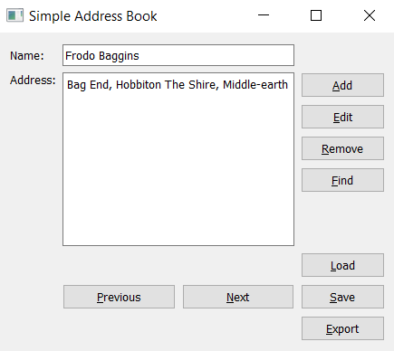
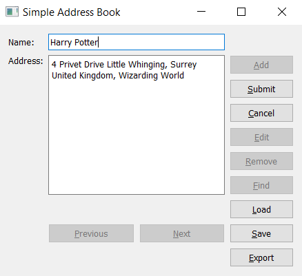
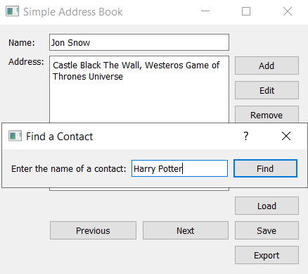
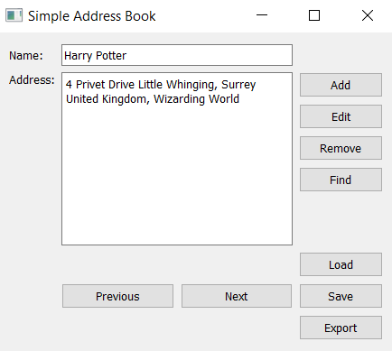
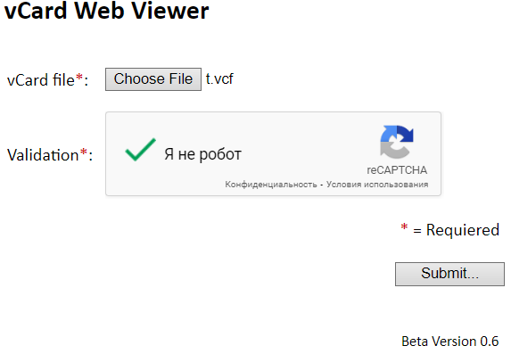

# Лабораторная работа № 2

## Тема: Разработка приложения «Адресная книга»

## Вариант 1

## Ход работы

Интерфейс программы:

Есть наличие кнопок для перехода между контактами вперёд/назад.

Добавление нового или изменение существующего контакта:

Так же есть возможность удалять контакт.

Возможность поиска контакта:

Сохранение/загрузка адресной книги:

Экспорт в виде vCard:

Просмотр vCard в сторонней программе:

