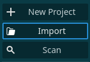
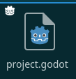
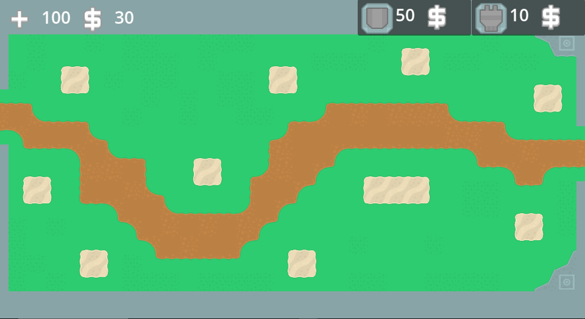
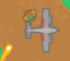
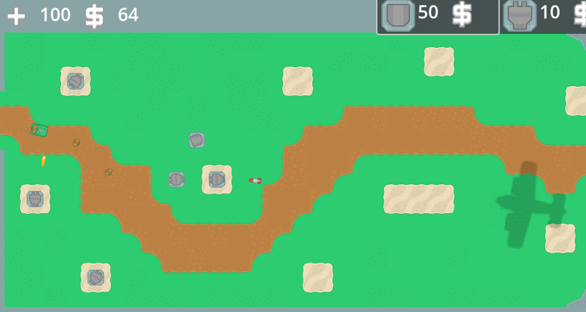
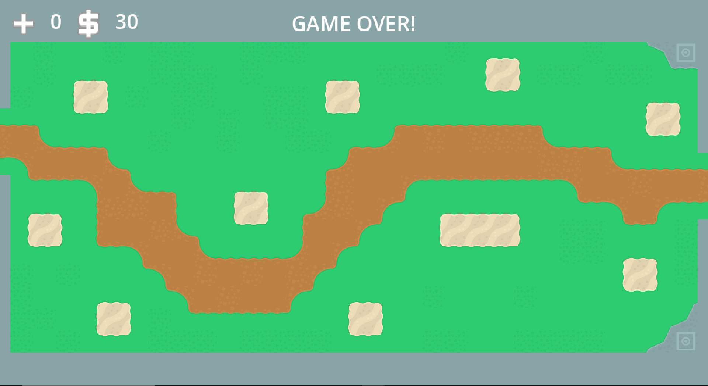

# Лабораторная работа № 4-5 #

## Тема: Создание игры ##

## Вариант 6. Tower Defense ##

## Ход работы ##

Как открыть проект:

- Скачать и запустить Godot

https://godotengine.org/

- выбрать Import

- выбрать файл с нужным расширением

Запуск игры:

Реализация бонуса:
- с 4% шанса выпадает с врага бонус

- наведя мышку на бонус он запускается

Проигрыш:

