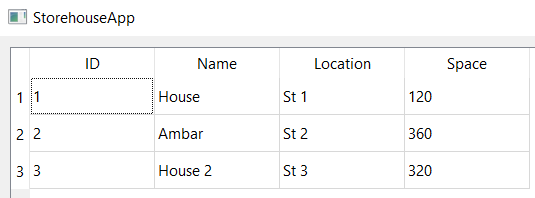
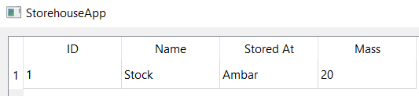
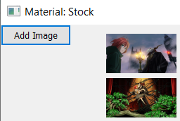

# Лабораторная работа № 7 #

## Тема: Разработка пользовательских графических интерфейсов СУБД средствами Qt ##

## Вариант 4. Склад материалов ##

## Ход работы ##

Организовали БД из 3 таблиц:

Пример 1 таблицы, склады:

Через меню, вызываем с помощью ПКМ, открываем таблицу с материалами принадлежащим выделенному складу:

Также через меню открываем фотографии принадлежащие данному материалу:

