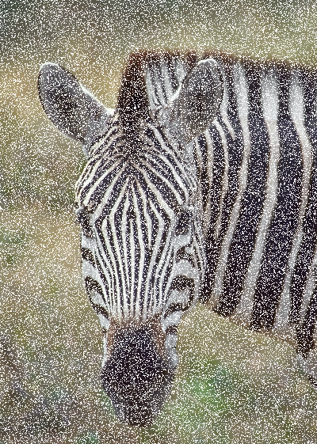
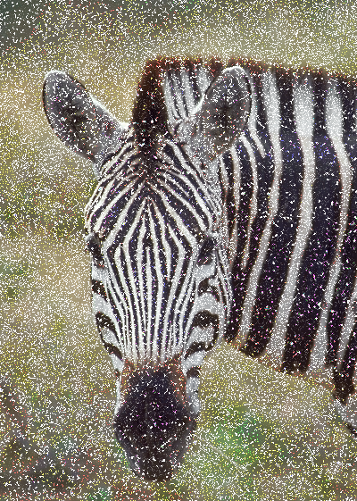

# Лабораторная работа № 1

## Тема: Фильтрация изображения от импульсных помех

## Вариант 1

## Реализация/ход работы

1. Оригинальное фото:
   <br><br><br>
   

2. Зашумленное фото:
   <br><br><br>
   

3. Обработанное фото:
   <br><br><br>
   

**Пороговое значение в ходе тестирование было установлено на 128**

Инструкция по применению:

**Заранее установленный nvm or node js(В данном случае юзалась 14.13.1)**

```
cd task_01/src
npm i
npm run start
```

**Далее переходим в браузер _localhost:3000_ и выбираем фото, поочередно нажимаем на кнопки**

# Пример фото в браузере:

**Чем больше размер фото, тем дольше будет идти его обработка**


