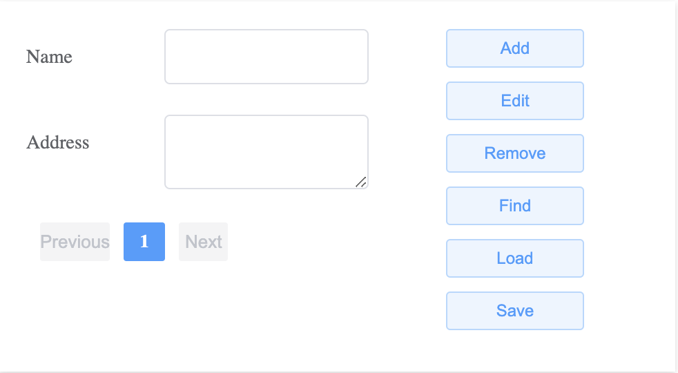
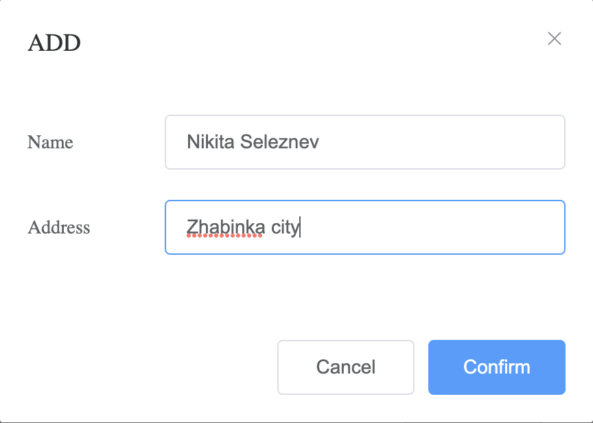
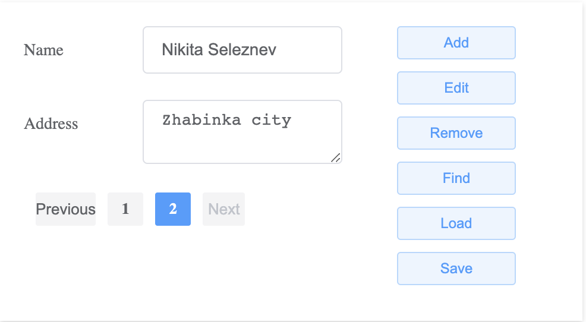
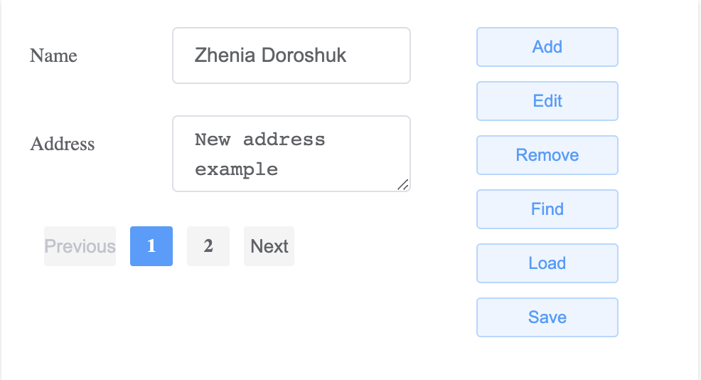
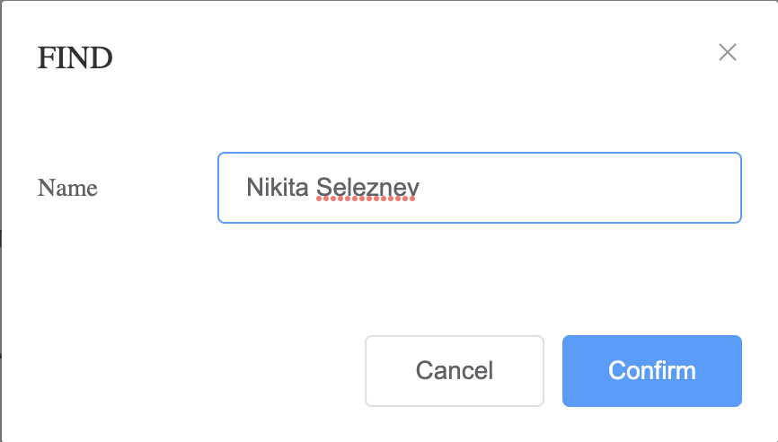
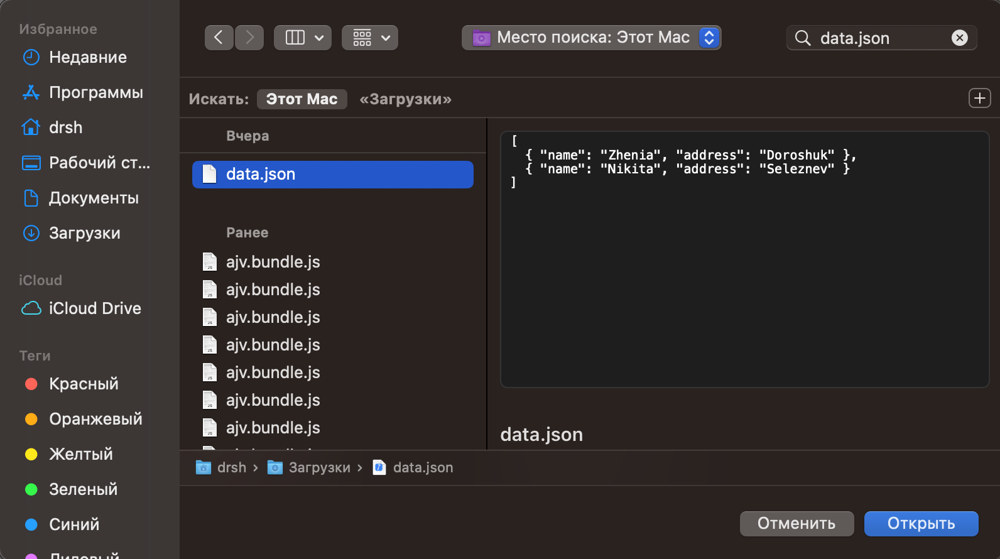

# Лабораторная работа № 2

## Тема: Разработка приложения «Адресная книга»

## Вариант 1

## Реализация

Главное окно:
   
   

Окно добавления:
   
   

Пагинация:
   
   

Окно изменения:
   
   
   
   
   
   

Окно удаления:
   
   
   
   

Окно поиска:
   
   
   
   

Сохранение:
   
   
   
   **Содержимое сохраненного файла**
   
   ```json
   [
      {
      "name": "Nikita Seleznev",
      "address": "Zhabinka city"
      }
   ]

Загрузка:
   
   

Инструкция по применению:

**Заранее установленный nvm or node js (В данном случае использовалась 14.13.1, Vue 2)**

```cmd
cd task_02/src
npm i
npm run dev
