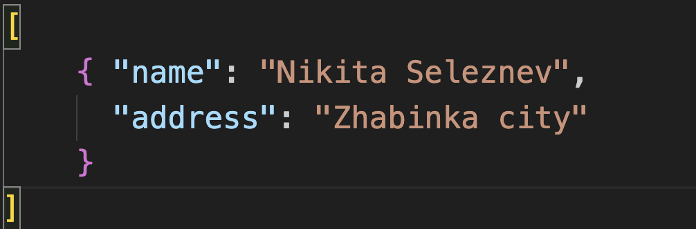

# Лабораторная работа № 2

## Тема: Разработка приложения «Адресная книга»

## Вариант 1

## Реализация

1. Главное окно:
   
   

2. Окно добавления:
   
   

3. Пагинация:
   
   

4. Окно изменения:
   
   
   
   
   
   

5. Окно удаления:
   
   
   
   

6. Окно поиска:
   
   
   
   

7. Сохранение:
   
   
   
   **Содержимое сохраненного файла**
   
   

8. Загрузка:
   
   

Инструкция по применению:

**Заранее установленный nvm or node js (В данном случае юзалась 14.13.1, Vue 2)**

```cmd
cd task_02/src
npm i
npm run dev
