# Лабораторная работа № 3

## Тема: Создание сайта по заданной тематике. Aviasales.com

## Вариант 3

## Реализация

Главное окно с фильтром:

   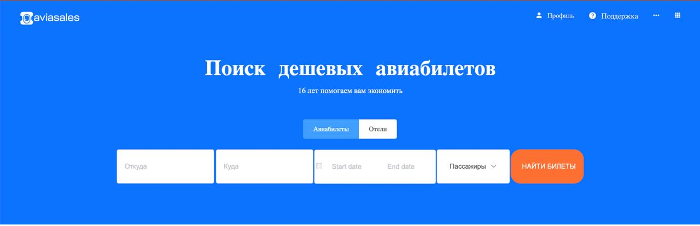

Главное окно с популярными направлениями:

   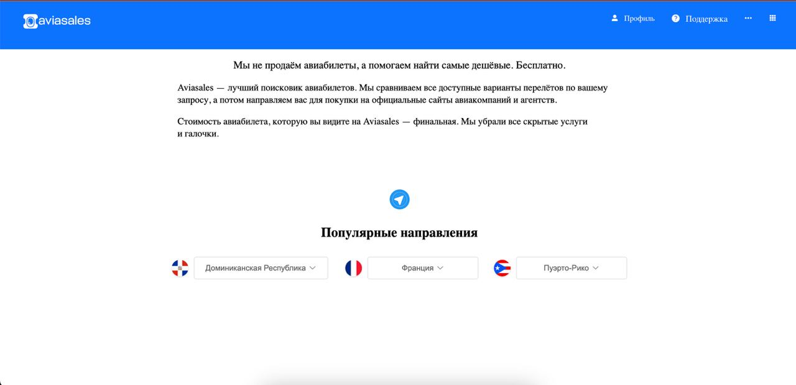

Элементы профиля при наведении курсора:

   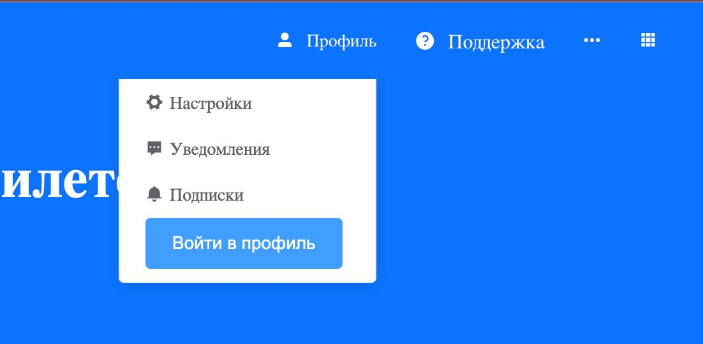

Элементы валют при наведении курсора:

   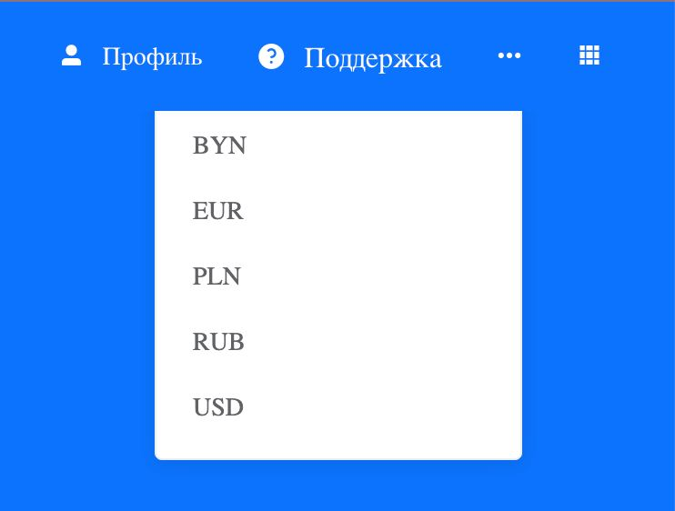

Элементы поддержки при наведении курсора:

   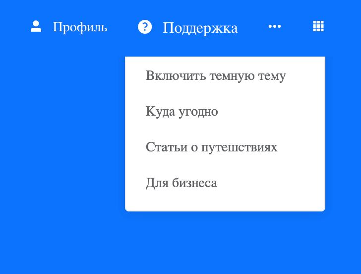

Пример ввода даты отправления и приземления:

   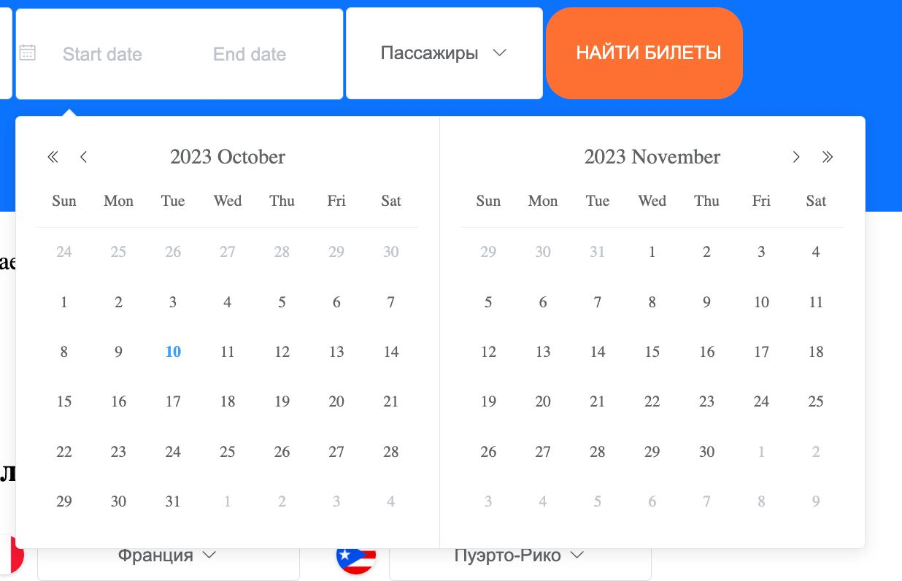

Пример конфигурации количества пассажиров:

   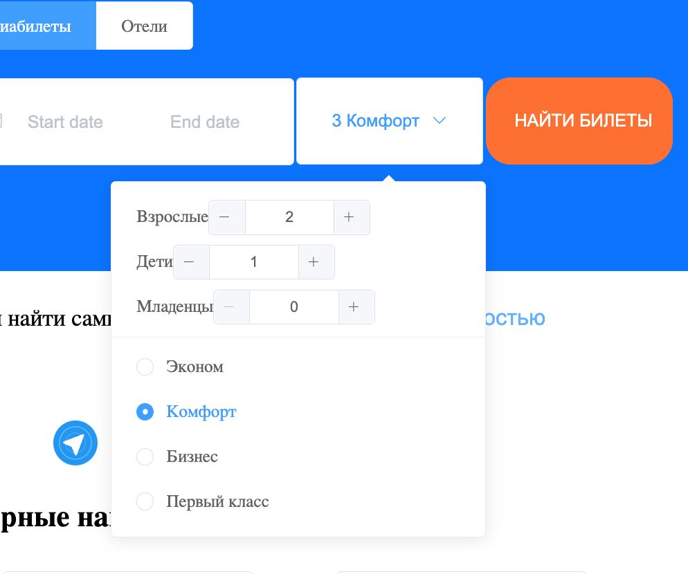

Пример списка доступных рейсов по нажатию:

   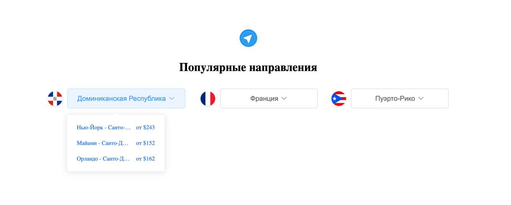

Главное окно отелей по нажатию:

   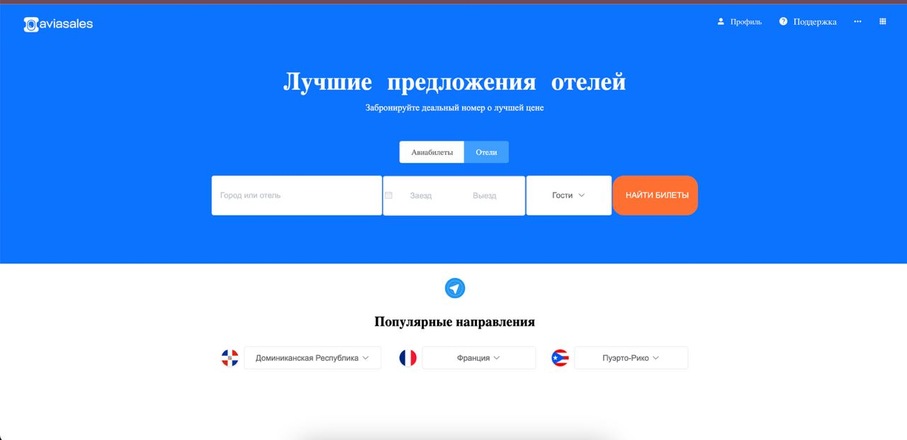

Пример выбора гостей в отель:

   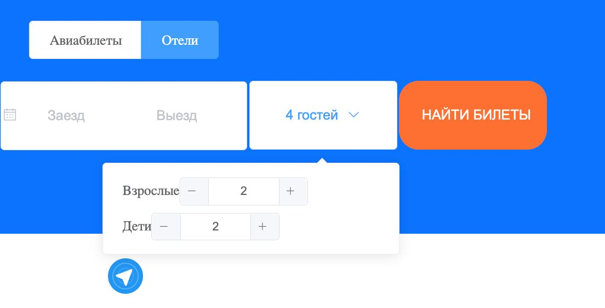

Пример рейса по направлению:

   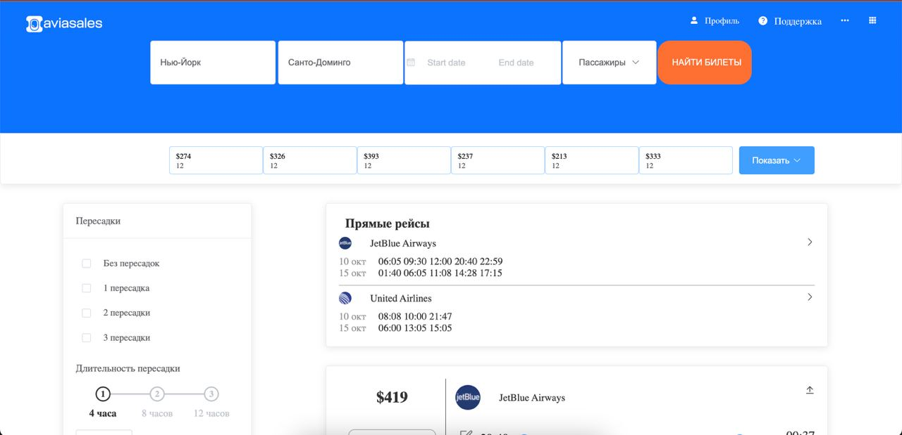

Пример рейса по направлению:

   

   

   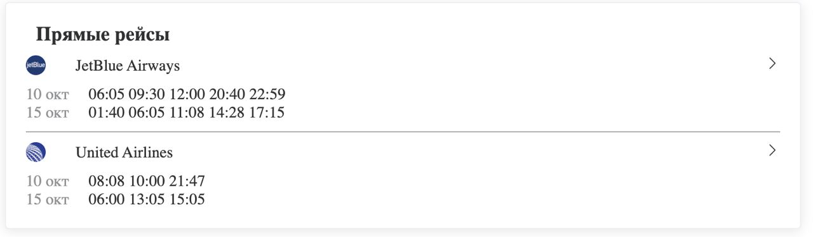

Пример боковой понели в окне рейса:

   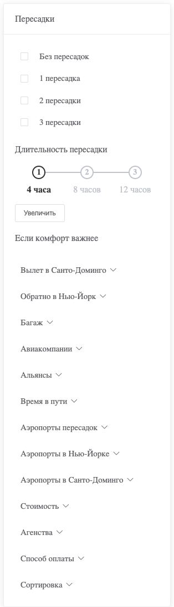

Пример детального окна рейса:

   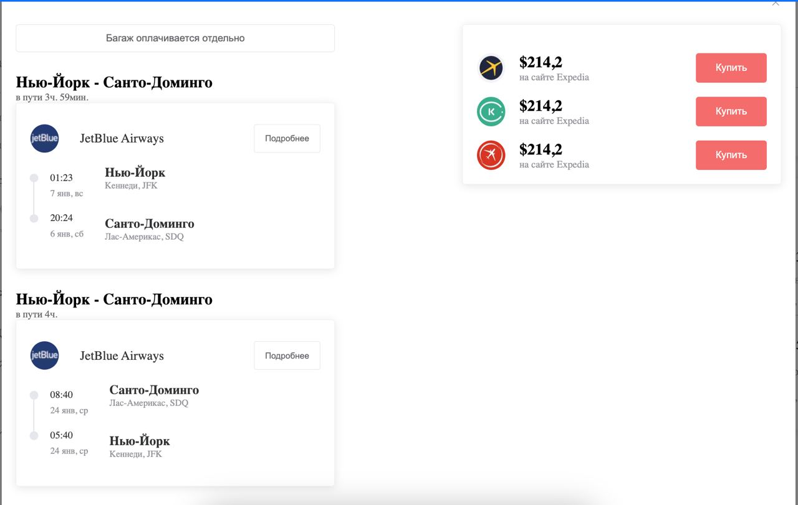

Пример увеличения времени по нажатию окна:

   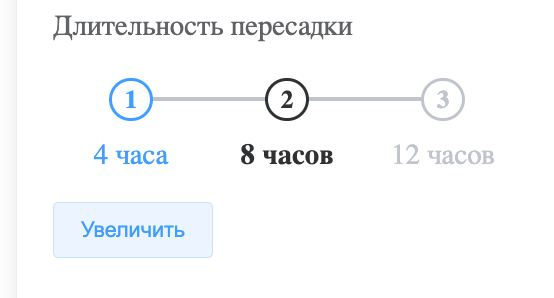

Инструкция по применению:

**Заранее установленный nvm or node js (В данном случае использовалась 14.13.1, Vue 2)**

```cmd
cd task_03/src
npm install
npm run dev
```
