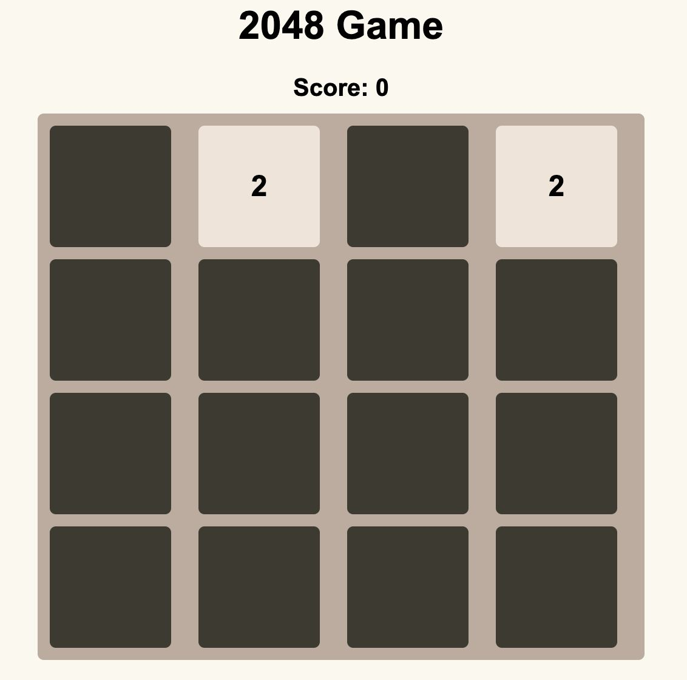
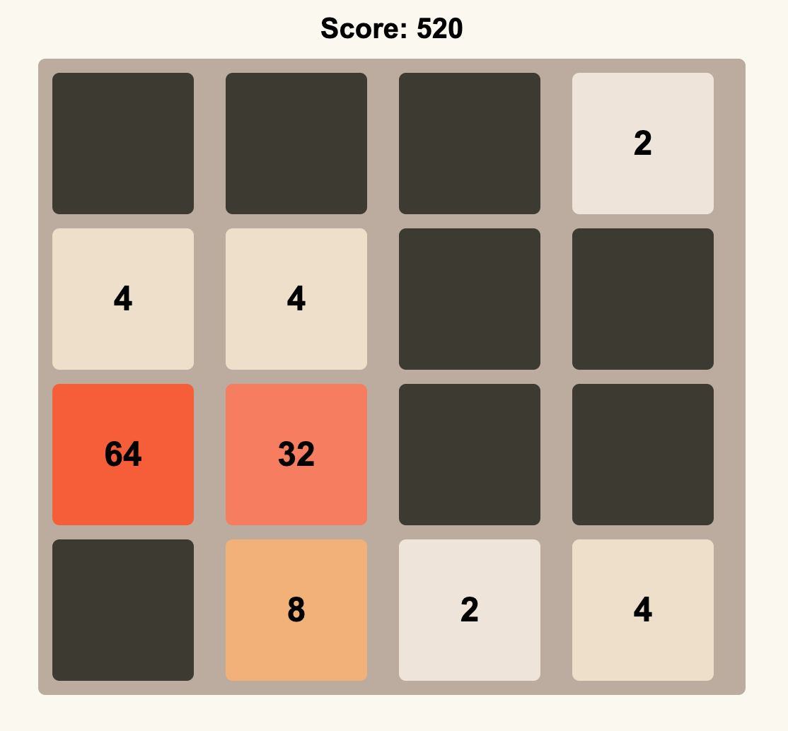
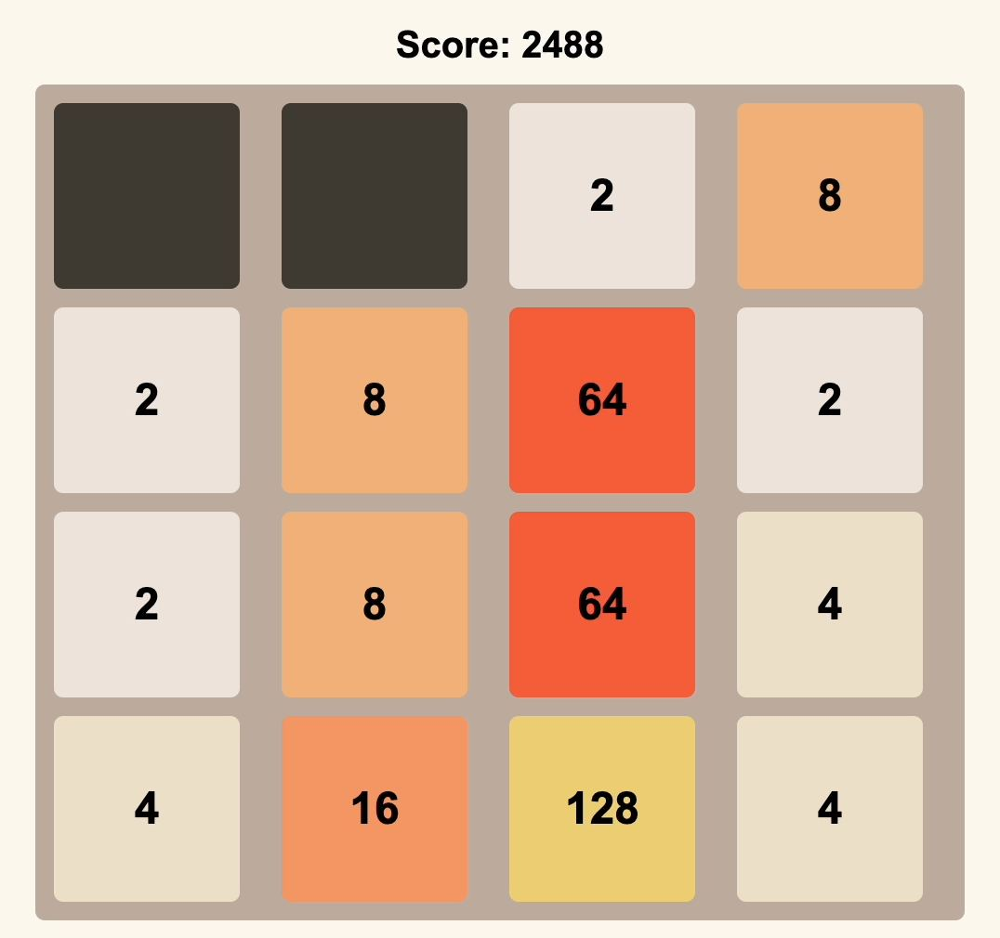
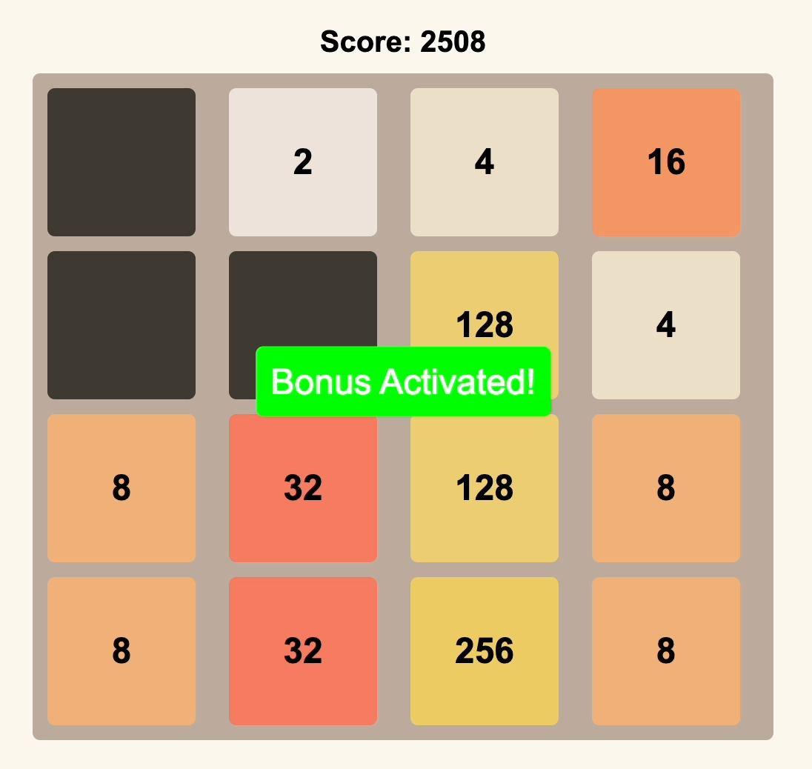
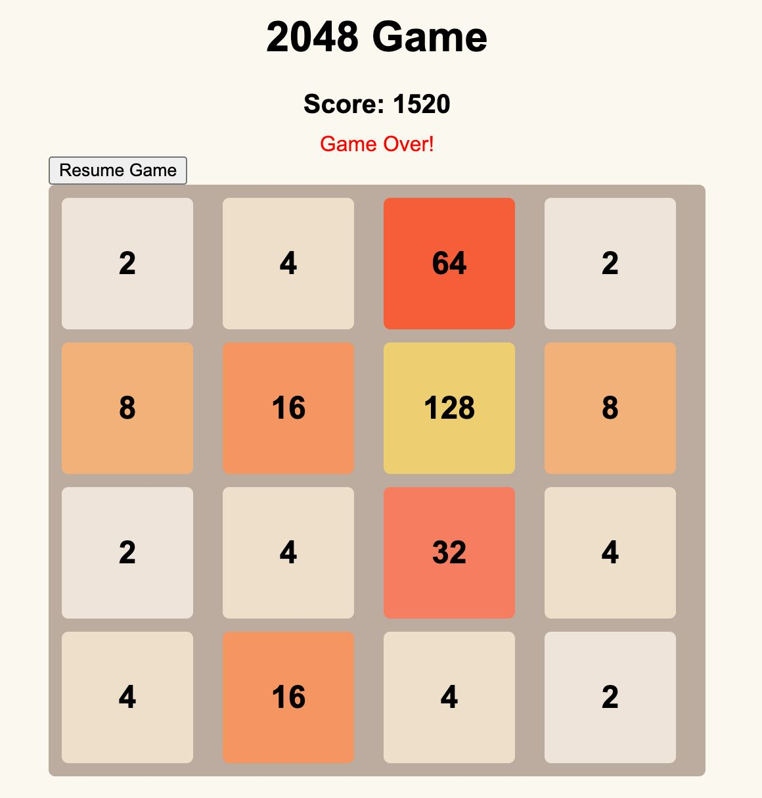

# Лабораторная работа № 4-5

## Тема: Создание игры 2048.

## Вариант 10

## Реализация

Начало игры:

   

Первый бонус - смещение влево двух ячеек с размерностью 16:

   

Увеличение счёта на 100 единиц:

   

Второй бонус - смещение вниз двух ячеек размерностью 64:

   

Увеличение размерности ячеек в два раза:

   

Обработка проигрыша:

   

Инструкция по применению:

**Открываем файл index.html**
