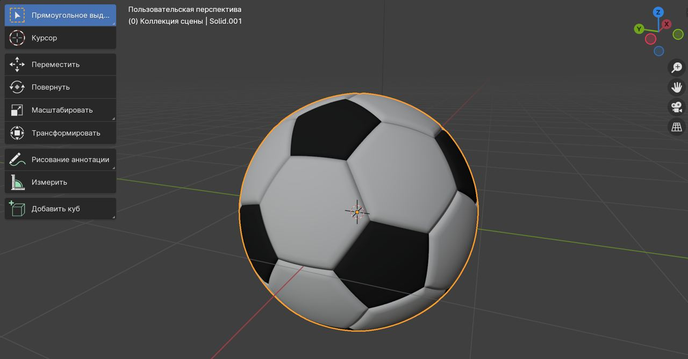
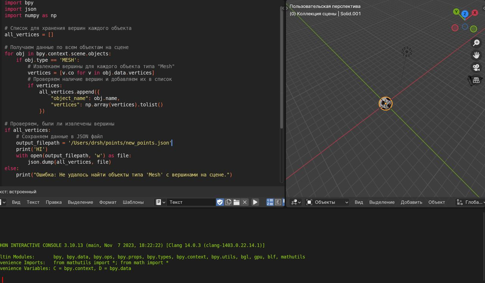
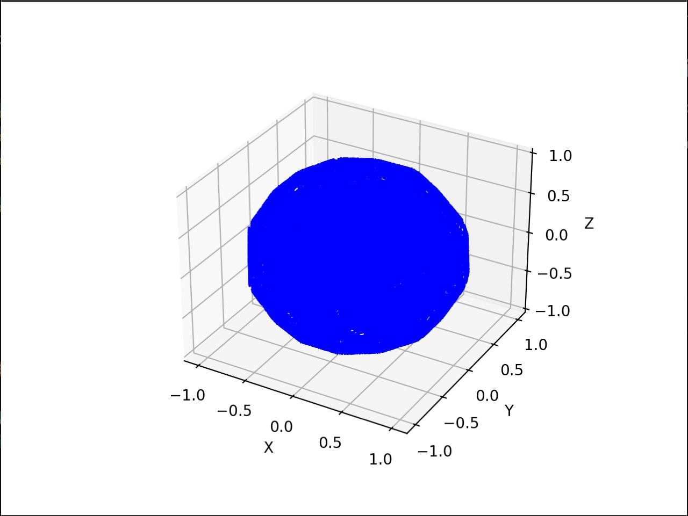

# Лабораторная работа № 7

## Тема: Алгоритм построения триангуляции Делоне.

## Вариант 1

## Реализация

### Разделяй и Властвуй

Скачиваем любую 3D модель:

   

Открываем Blender, scripting и вставляем скрипт с файла blender.py:

   

   **Пример скачанного json**

```json
   [
      {
      "object_name": "Name",
      "vertices": [-1, 1, 0]
      }
   ]
```  

Итоговое отображение после выполнения алгоритма:

   
