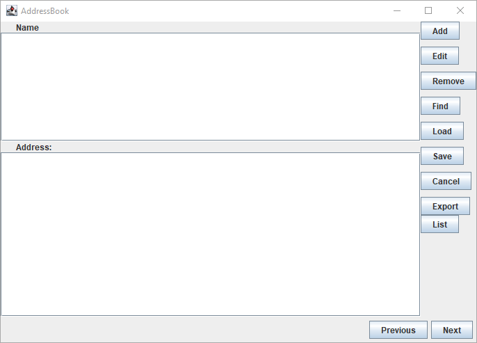
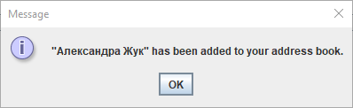
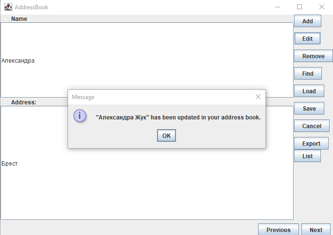
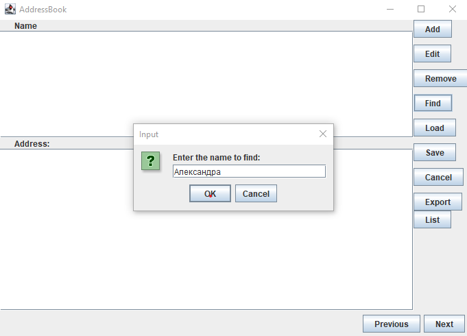
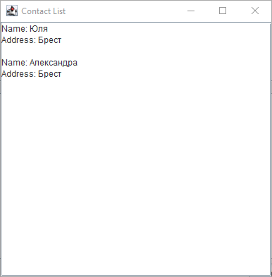
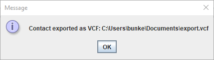
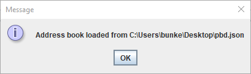

# Лабораторная работа № 2

## Тема: Разработка приложения «Адресная книга»

## Вариант 1

## Реализация

Главное окно:

   

Окно добавления:

   

Окно изменения:

   

Окно удаления:

   

Окно поиска:

   

Список контактов:

   

Сохранение:

   

Экспорт:
   


   **Содержимое сохраненного файла**

```json
{
  "roma": 
  {
    "name": "roma",
    "address": "minsk"
  }
}
```

Загрузка:

   