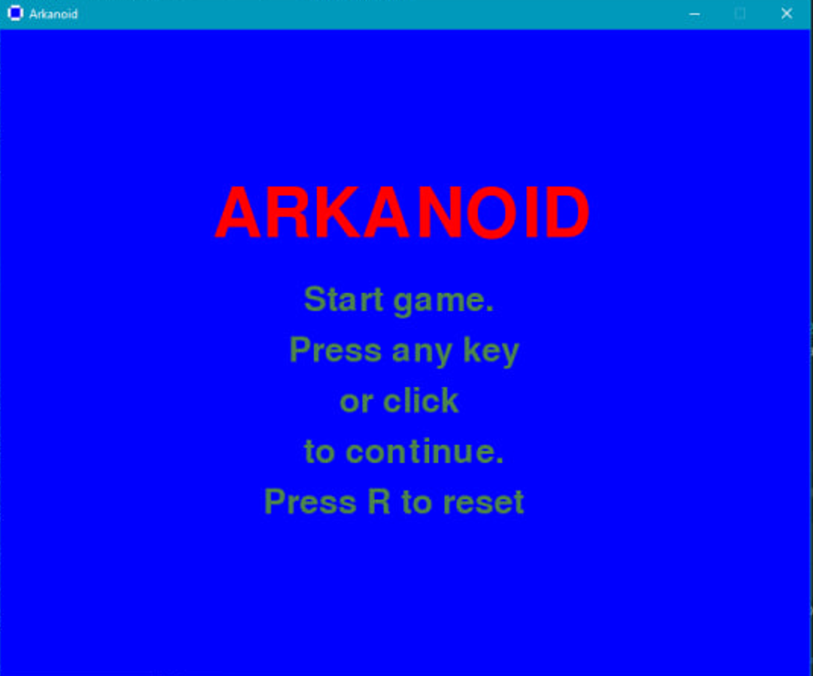
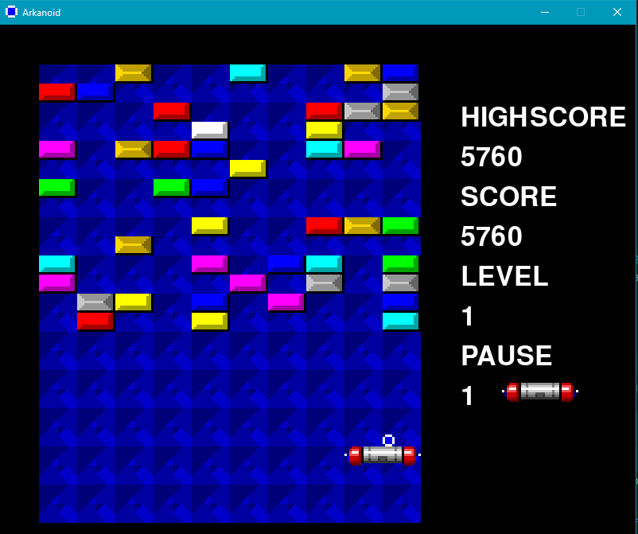
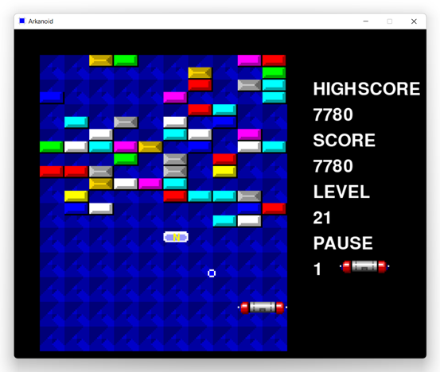

# Лабораторная работа № 4-5

## Тема: Создание игры по заданному варианту. Arcanoid

## Вариант : 3

## Реализация

Все виды призов:
    «L» - лазер, при нажатии платформа стреляет и разбивает блоки. Доступен с 0 ур.
    «E» - расширяет платформу (возможно расширять до 2 раз). Доступен с 0 ур.
    «S» - стандартный. Доступен с 10 ур.
    «B» - уничтожает платформу. Если нет доп. платформ, проиграете. Доступен с 20 ур.
    «P» - даёт доп. платформу. Доступен с 0 ур.
    «M» - мяч проходит сквозь неразбиваемые блоки, все разбиваемые разбивает за 1 раз, причём не отскакивает от блоков. Отскакивает только от летающих врагов и от стенок. Доступен с 0 ур.
    «T» - 1 раз отбивает мяч, если он упал мимо платформы. Доступен с 0 ур.
    «N» - перейти на следующий уровень. Доступно с 20 уровня.

Главное окно :

   

Игра:

   

Бонусы:

   