# Лабораторная работа № 2

## Тема: Разработка приложения «Адресная книга»

## Реализация

Главное окно:
   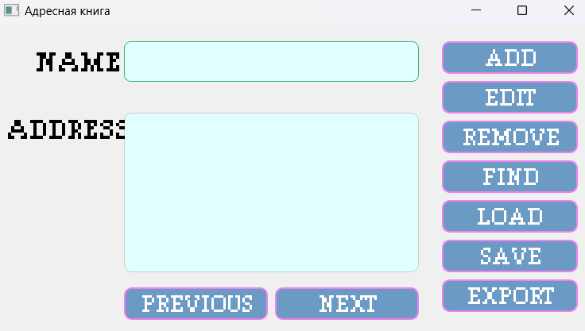

Окно добавления:
   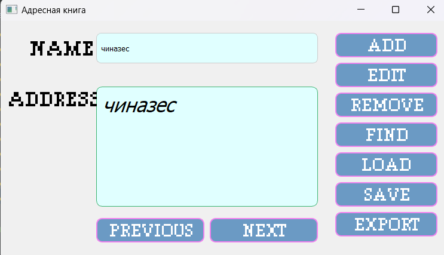
   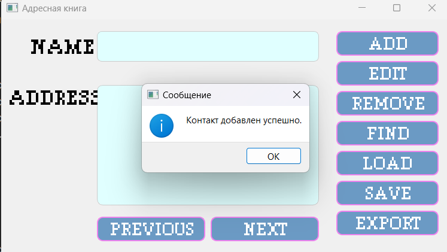

Окно изменения:
   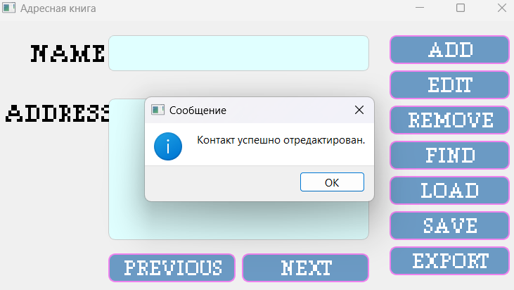

Окно удаления:
   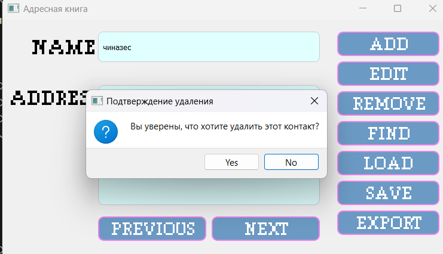
   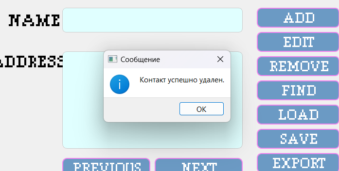

Окно поиска:
   
   

Список контактов:
   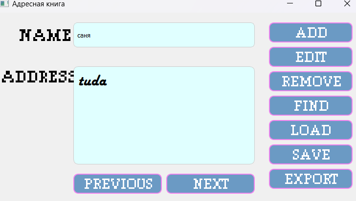
   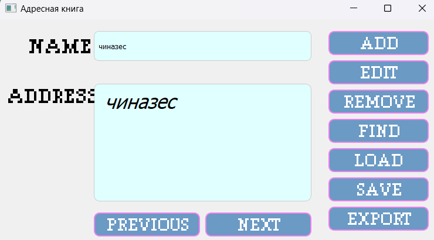

Сохранение:
   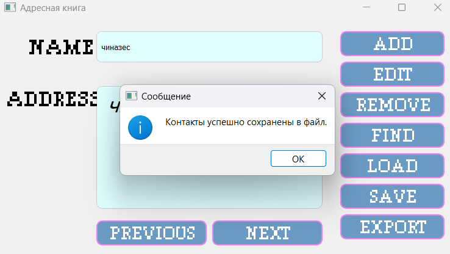

Экспорт:
   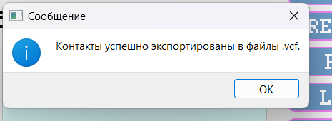

## Содержимое сохраненного файла

```txt
саня;tuda
чиназес; чиназес

```

Загрузка:
   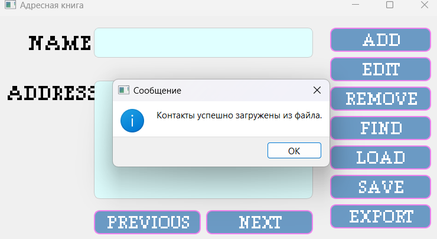
