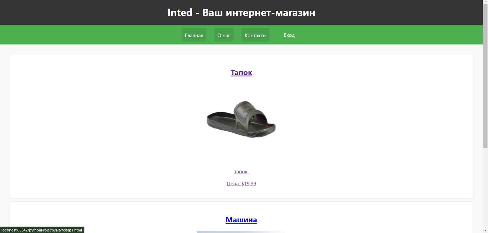
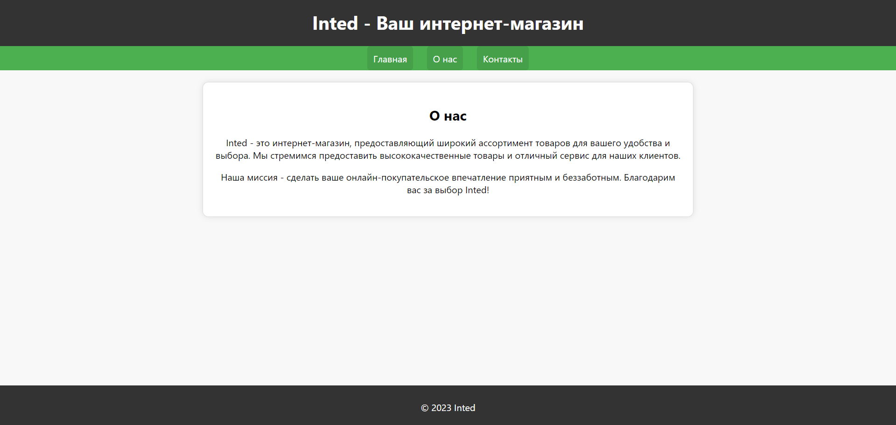
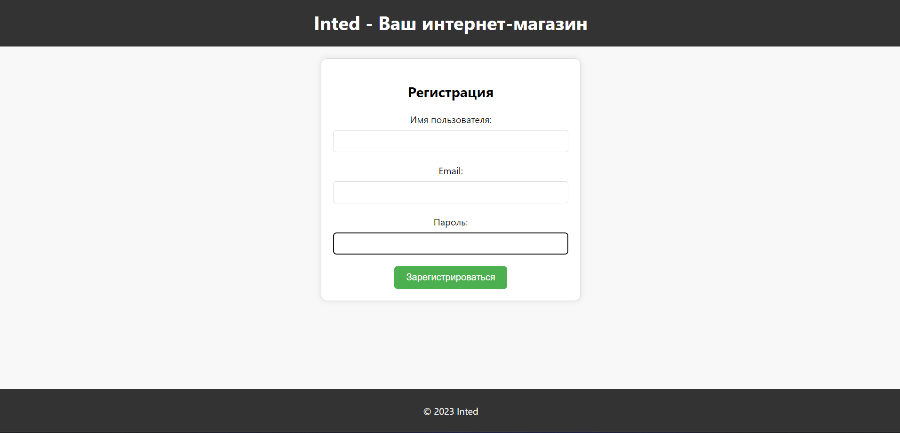

# Лабораторная работа № 3

## Тема: Создание сайта по заданой тематике (без функциональной части)

## Вариант 2. Сайт барахолки

## Ход работы

---

Разработанный шаблон.

Начальная страница:

Вывод объявлений. Навигация по страницам.

---

Страница контактов:

---

Страница Общей информации:

---

Страница регистрации:

Есть заполнение полей.

---

Страница просмотра объявления:

---

