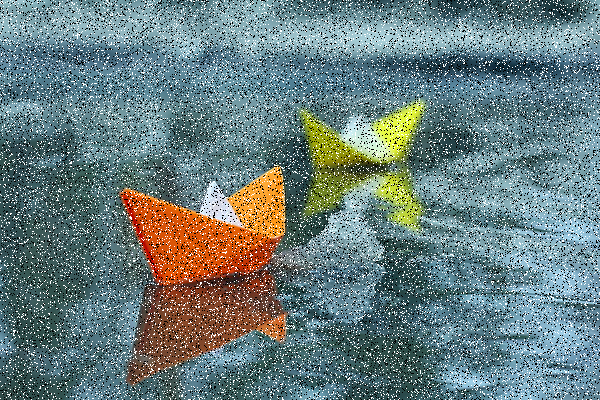

# Лабораторная работа №  1

## Тема: Фильтрация изображения от импульсных помех

## Вариант 2

## Реализация

Оригинальное изображение:

   

---
Изображение зашумливается (сильно):
   

---
Изображение после чистки фильтром
   

---

Интерфейс приложения

Можно выбрать уровень зашумленности(можно без), выбрать изображение
Также выбрать кол-во шума. Начать обработку.

