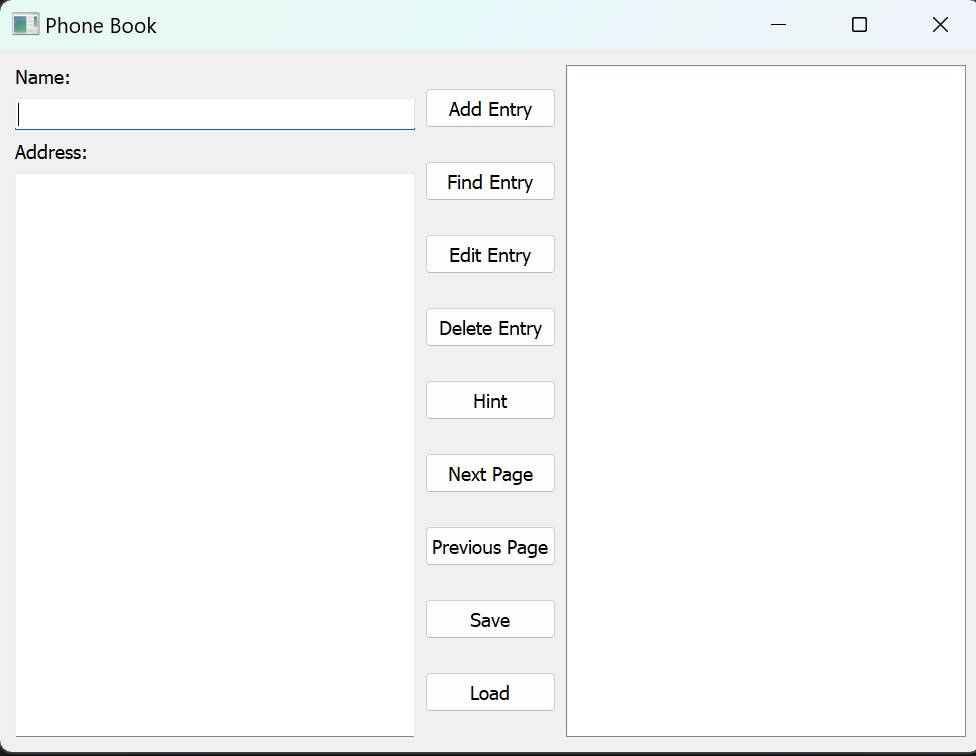
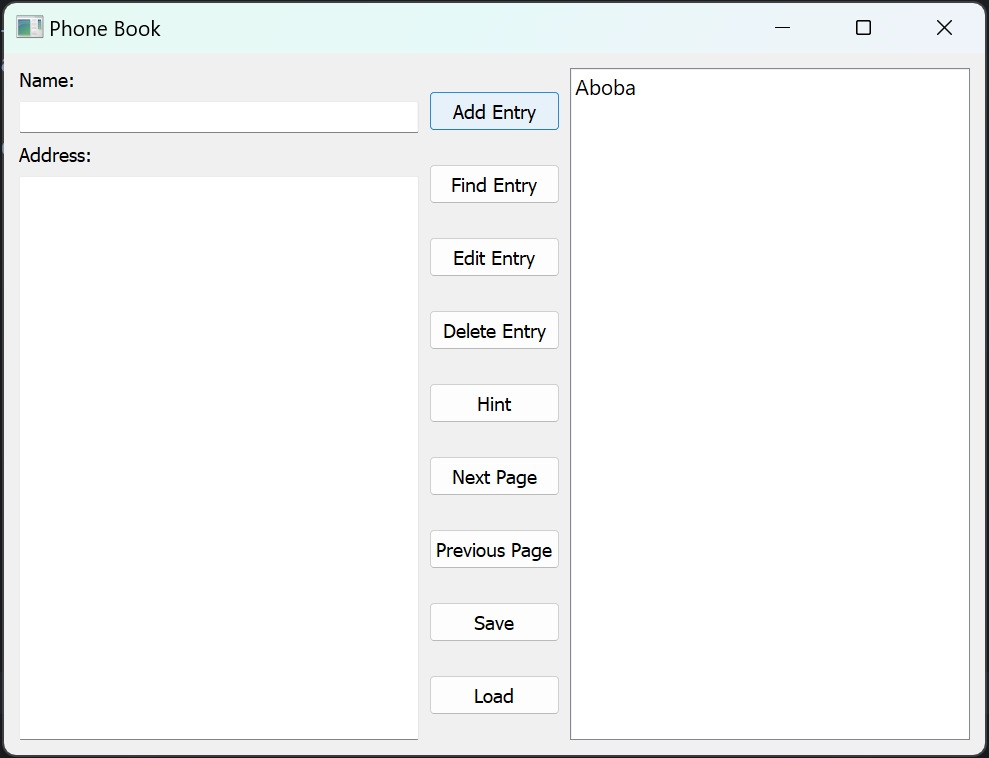
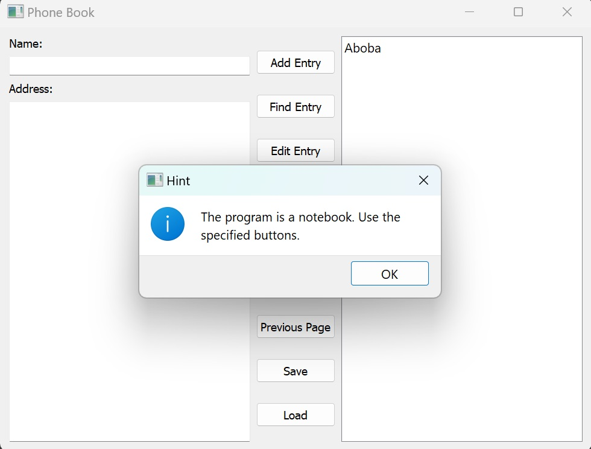
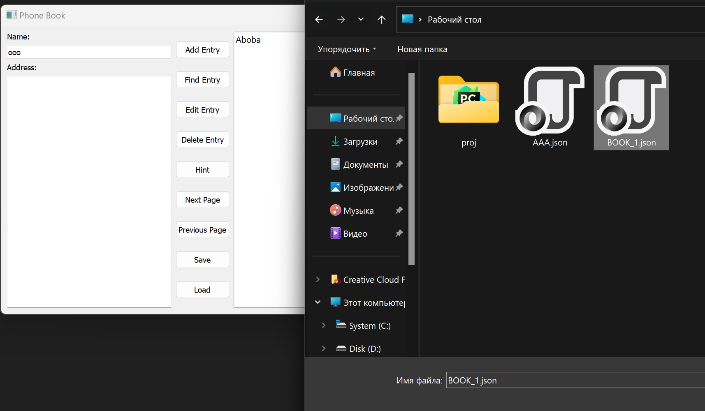
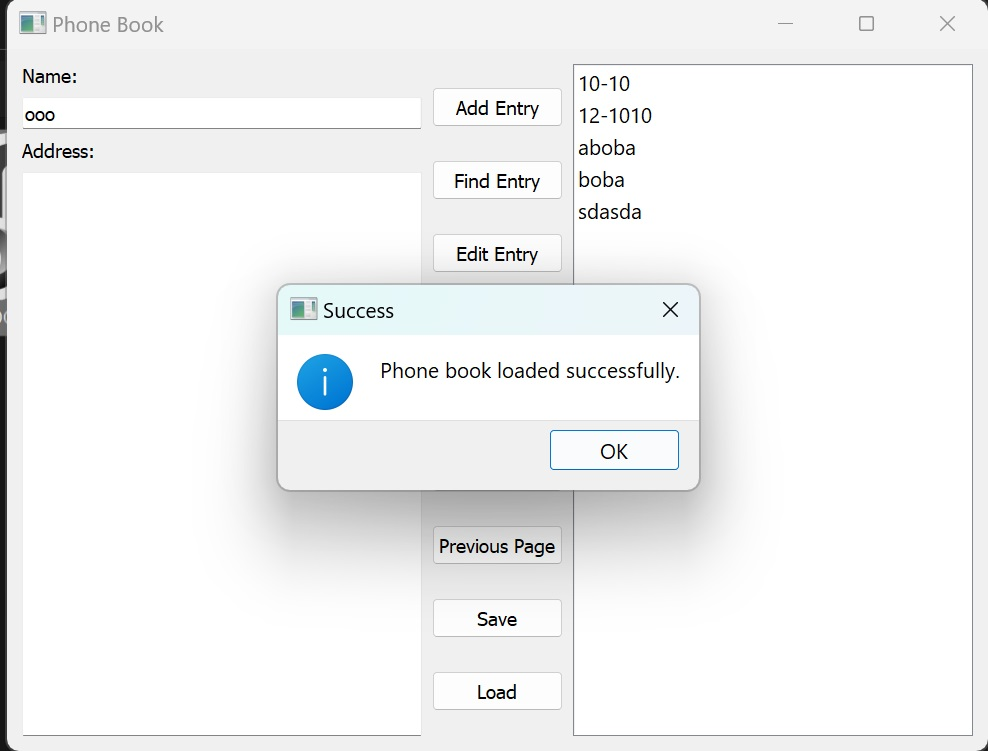
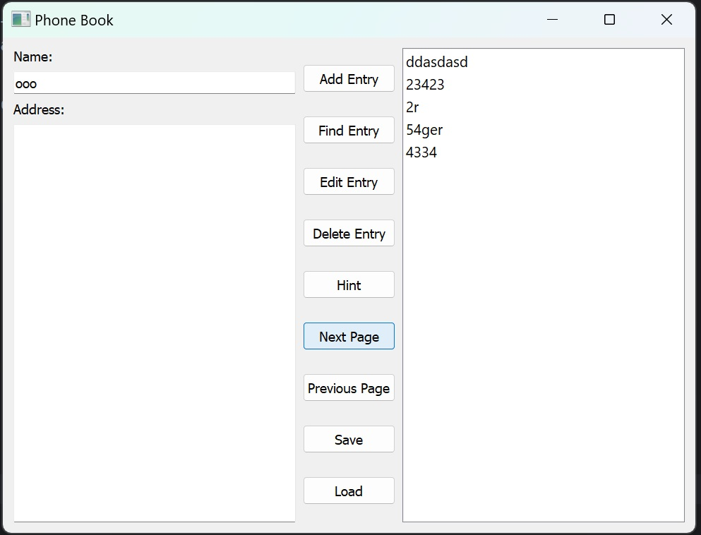
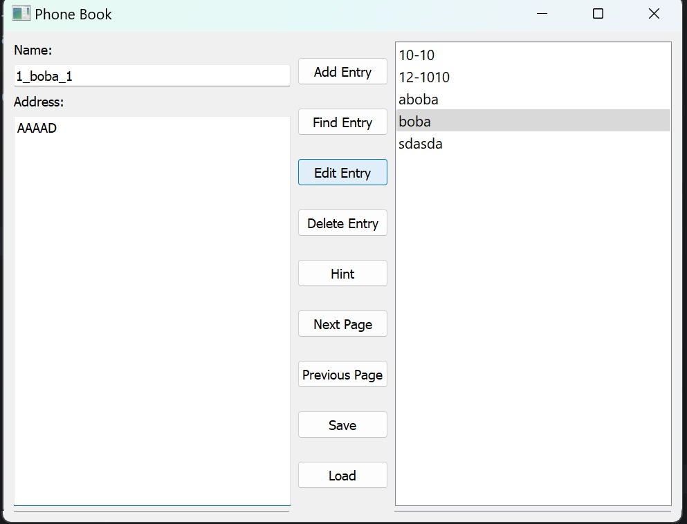
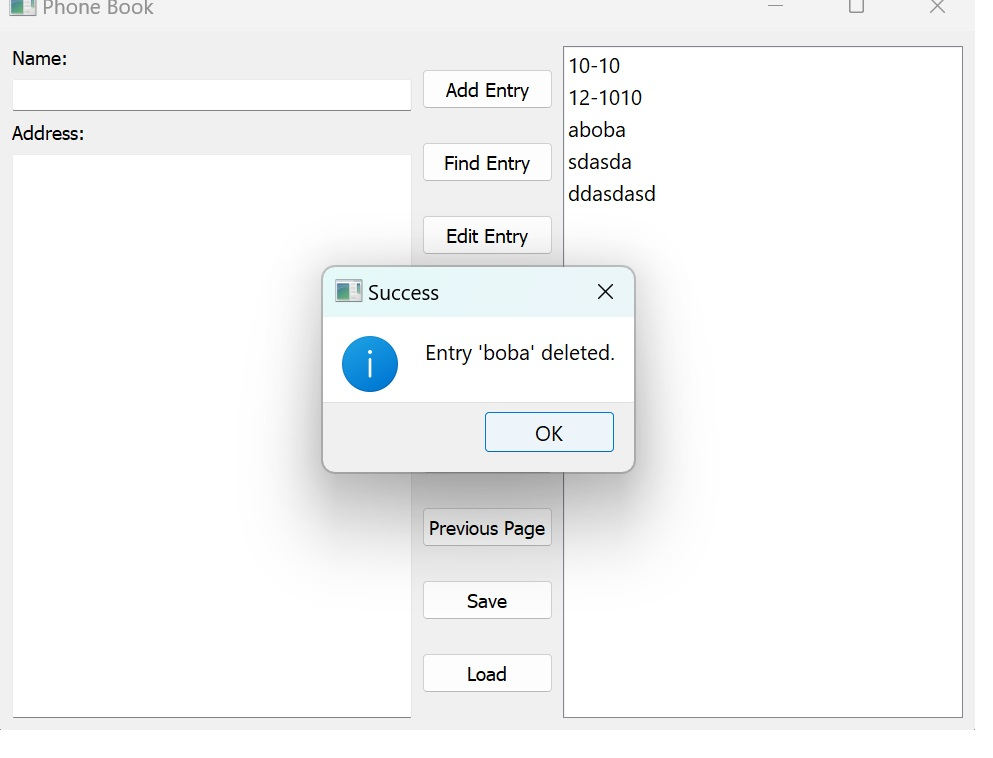
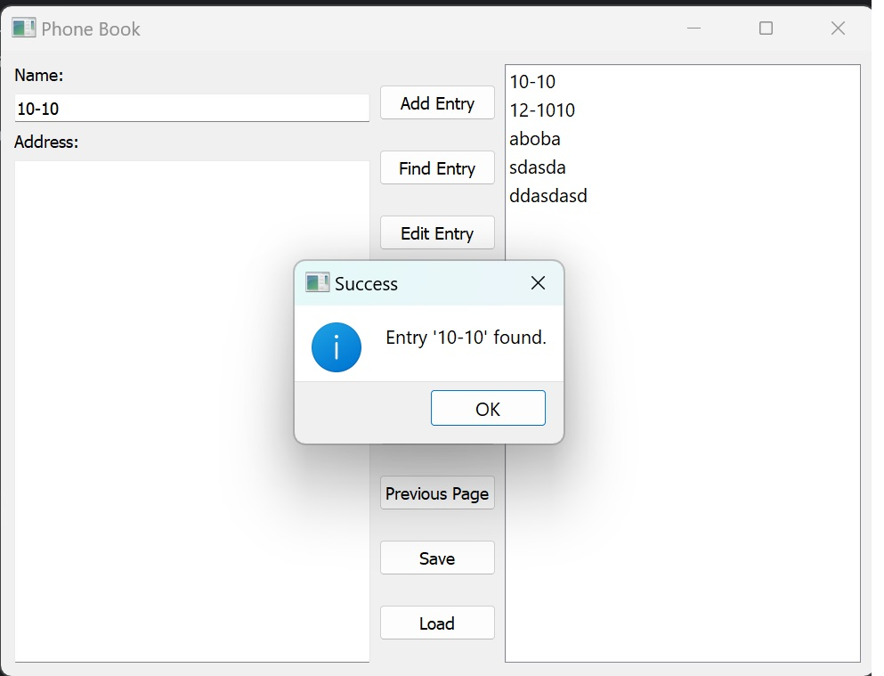

# Лабораторная работа № 2

## Тема: Разработка приложения «Адресная книга» средствами Qt

## Вариант 2

## Ход работы

Цель работы: изучить базовые компоненты средства разработки
графического интерфейса среды Qt

Язык python

---

Интерфейс программы, главное окно:



Два поля вывода(Имя и адресс, соответственно)

Все кнопки управления в центре

Справа находиться поле для вывода записей

----



Добавление записи. Она отобразиться справа

---



Кнопка помощи. Тут находиться справка по программе

---



Сохранение книги. Храниться в файле формата json.

---



Загрузка книги из файла

---



Пейджизация. На одной странице отображается 
максимум 5 записей. Чтобы перейти дальше или 
вернуться назад есть соответствующие кнопки

---



Возможность редактирование записи. Редактировать
можно как имя так и адресс

---



Удаление записей

---



Поиск. Работает по имени. Берет значения из поля 
name. Если записи нет, то выведет предупреждение

---

Для запуска необходим интерпретатор python версии 3.11 
и настроенное виртуально окружение

```cmd
pip install -r requirements.txt 
python main.py
```
