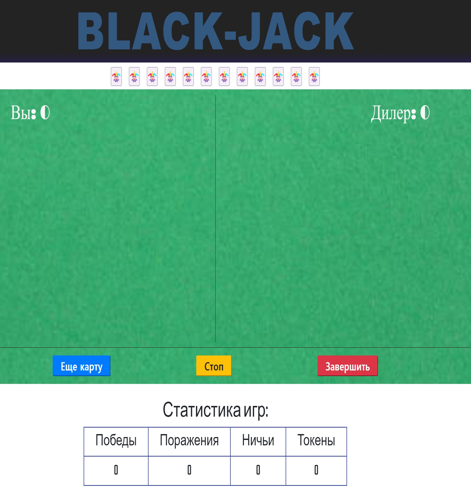
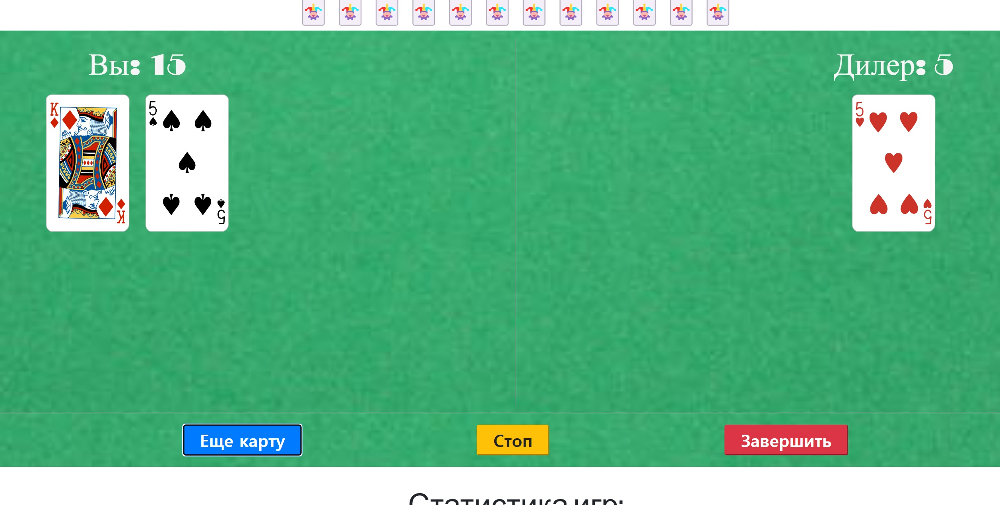
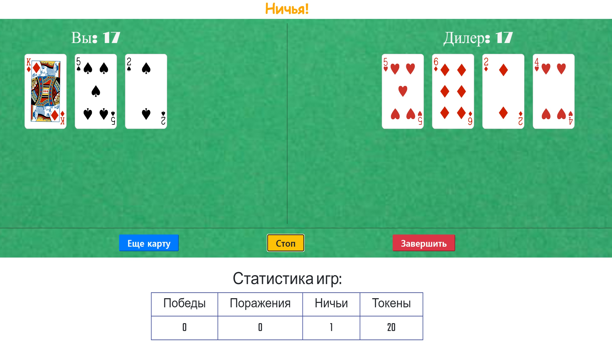
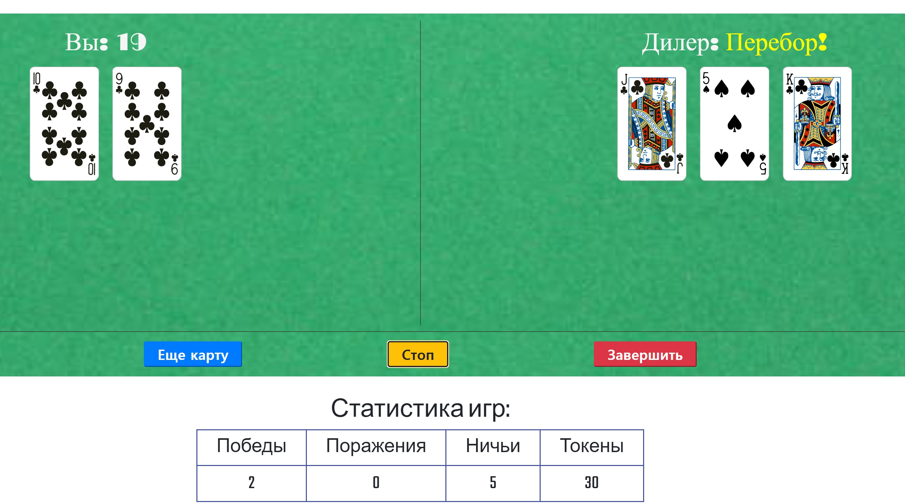
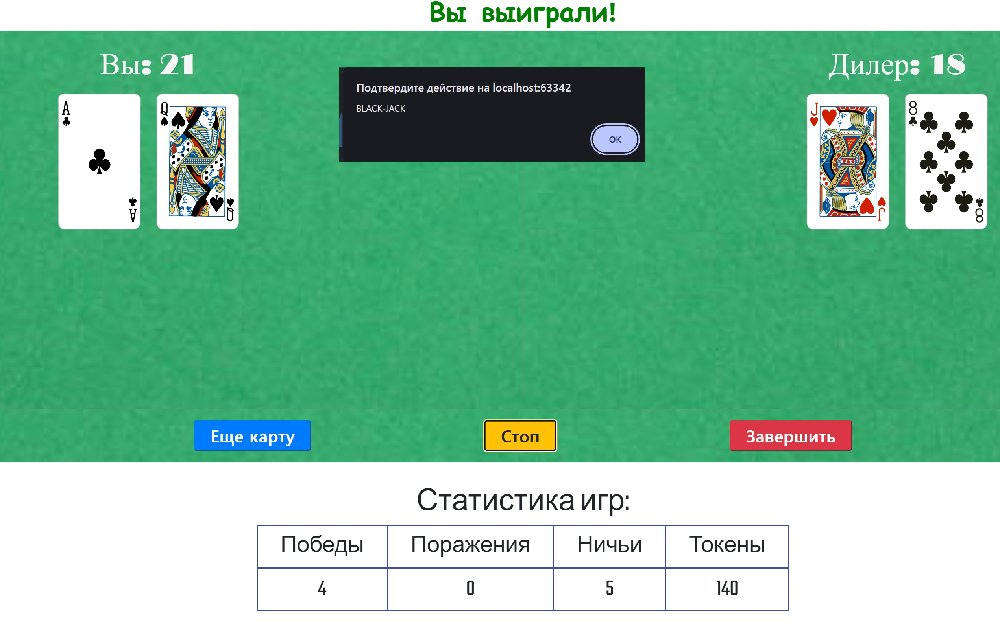

# Лабораторная работа № 4-5

Проектирование и создание

## Тема: Создание "казино" игр

## Вариант 11 - "Блэк-джек"

## Реализация

---

Начало игры:

Стандартные правила. Карты по номиналу. Туз либо 11 либо 1, как выгоднее считать.
карты "с картинками" по 10 очков. Игрок начинает с 2 карт. Дилер с 1. Блэкджек
это 21 очко, набранное с 2 карт при сдаче.
Токены - условные "фишки" для игры. За поражение -3, за победу +5.

---

Начало игры:

После "сдачи"

Ничья:

Перебор у дилера, победа игрока:

Бонус - Блэкджэк. Игрок получает сразу +100 Токенов:

