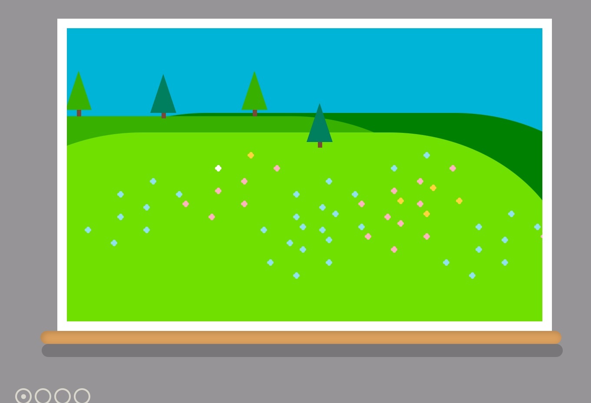
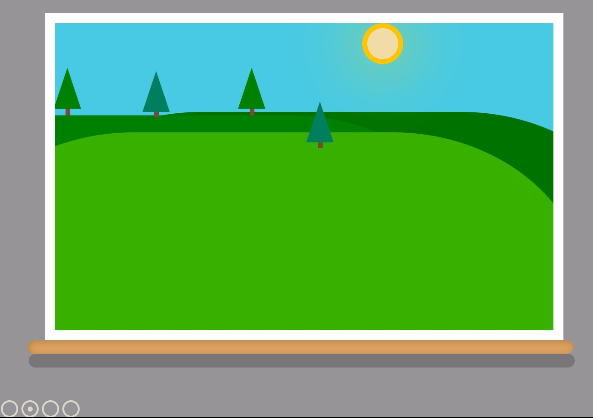
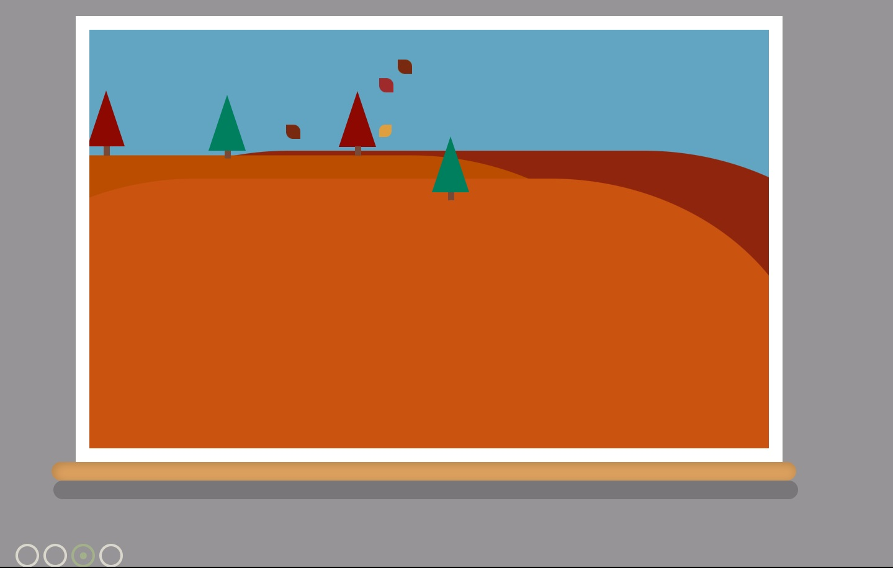
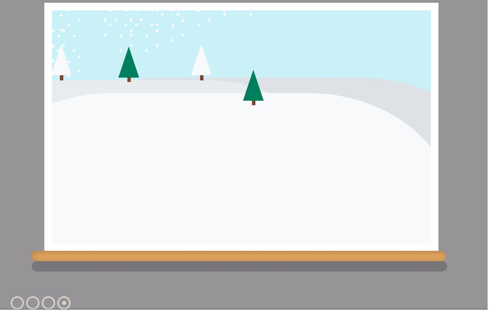
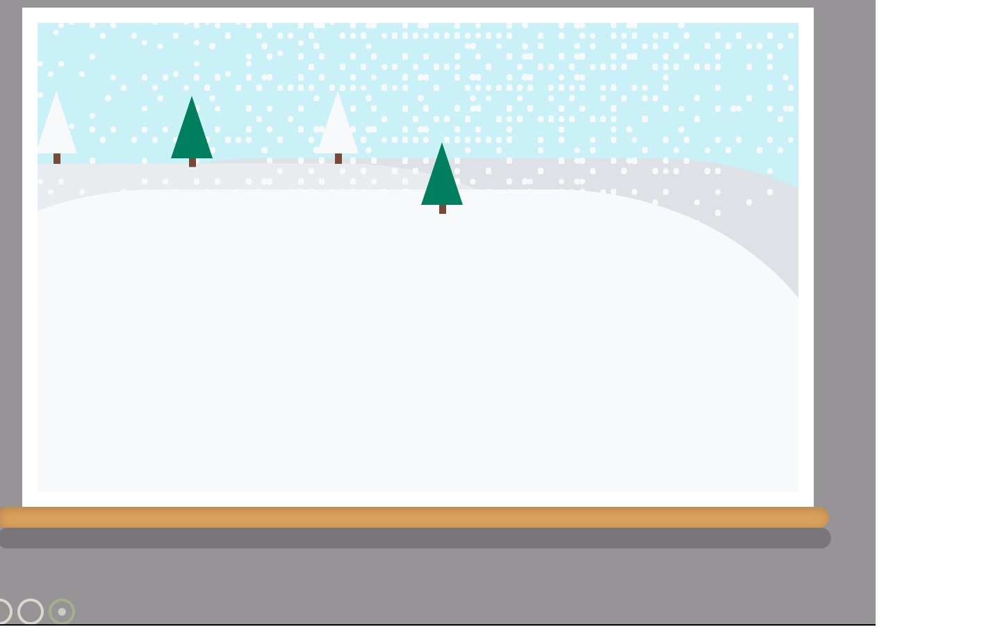
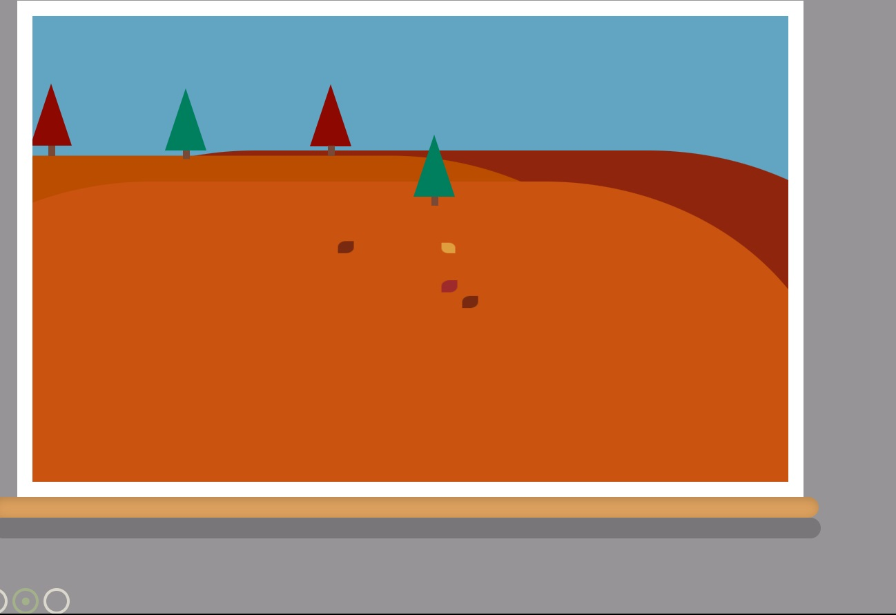

# Лабораторная работа № 6

## Тема: Изображения и анимация

## Вариант 7(Смена времен года)

## Реализация

### Средства 

Делать можно на любом программном обеспечении

Сделано на чистом HTML и CSS без JS

Окно, в котором меняются 4 времени года при нажатии на кнопку.

Весна:

   

---

Лето:

   

---

Осень:

   

---

Зима:

   

---

### Анимации

Анимации падащих листьев и снежинок.

   

   

Инструкция по применению:

**Открыть файл index.html**
