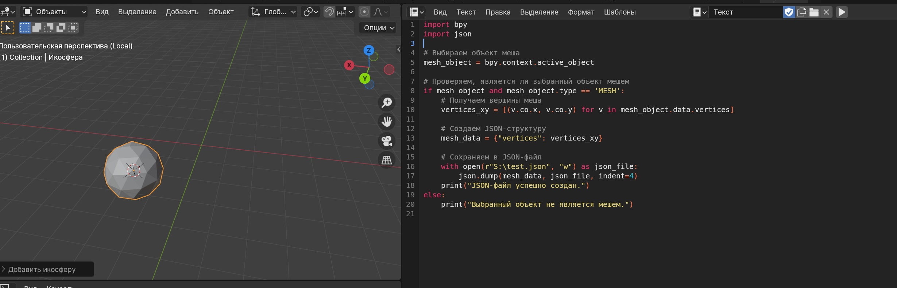
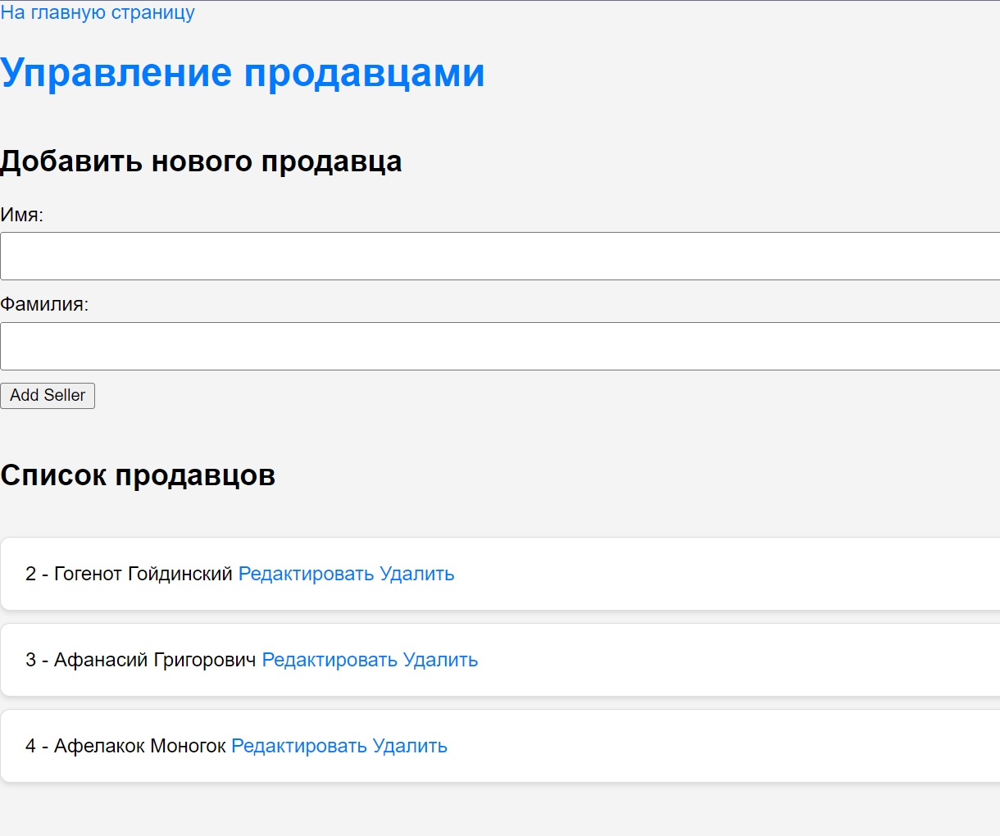
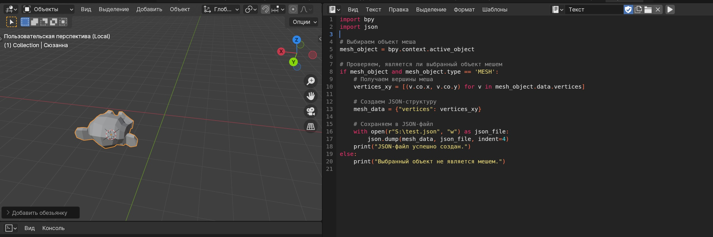
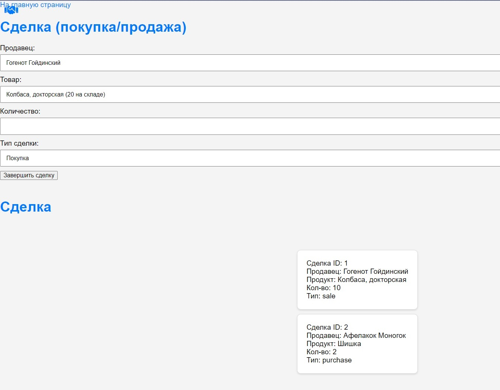
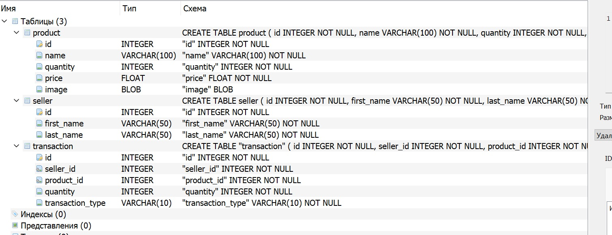
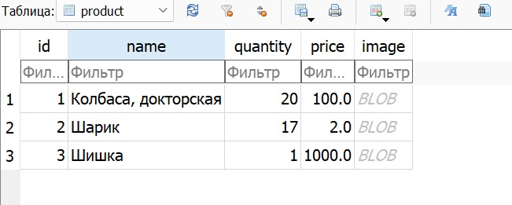

# Лабораторная работа № 7

## Тема: Разработка пользовательских графических интерфейсов для СУБД.

## Вариант 2 (Магазин Елочных Игрушек)

## Реализация

Требования к работе:

- Минимум 3 таблицы в БД
- Одно из полей типа BLOB
- База Sqlite

Разработать интерфейс взаимодействия пользователя

### Делать можно на любом программном обеспечении

Для работы был выбран фрейморк Flask, для работы с БД
SqlAlchemy

Главная страница

   

Менеджер продавцов

   

Менеджер склада товаров

   

Менеджер Сделок

   

База данных

   

База данных

   

Сделки связаны с продавцами и товарами, также там есть вычисления кол-ва товара

Инструкция по применению:

**Запустить файл python. Необходим рабочий venv для проекта со всеми зависимостями**
