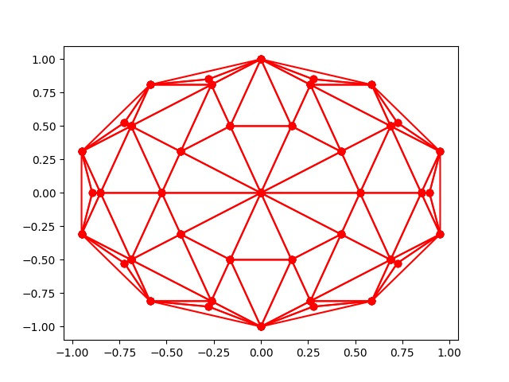
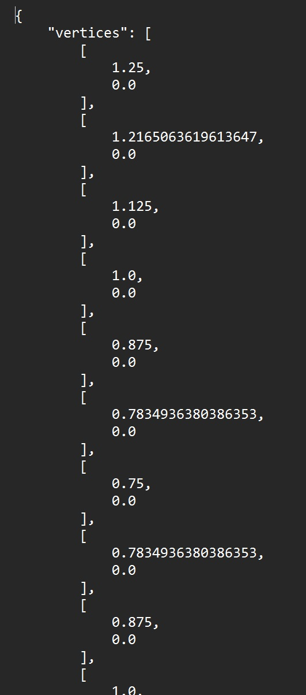
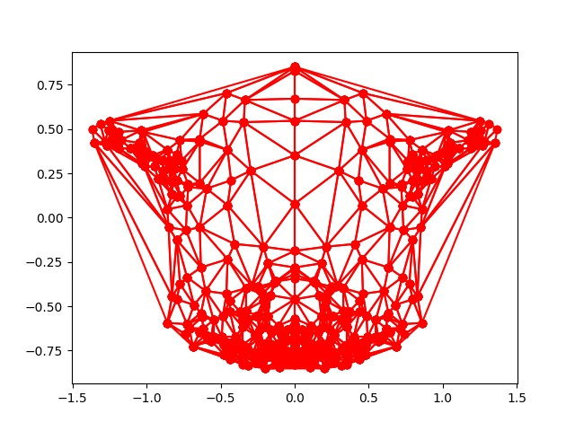
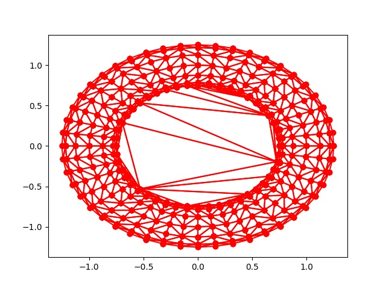

# Лабораторная работа № 7

## Тема: Триангуляция Делоне.

## Вариант 2 Рекурсивный алгоритм

## Реализация

Нужно взять модель для 3д редактора, например Blender, после чего
экспортировать ее в виде вершин для триангуляции

Возьмем один из стандартных мешей бленедера и "разберем" его

   

Также тор

   

Также Сюзанну

   

После обработки алгоритмом выводим

   

Как выглядит структура json файла

   

После обработки алгоритмом выводим Сюзанну

   

После обработки алгоритмом выводим тор

   
