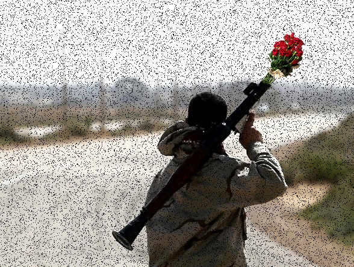
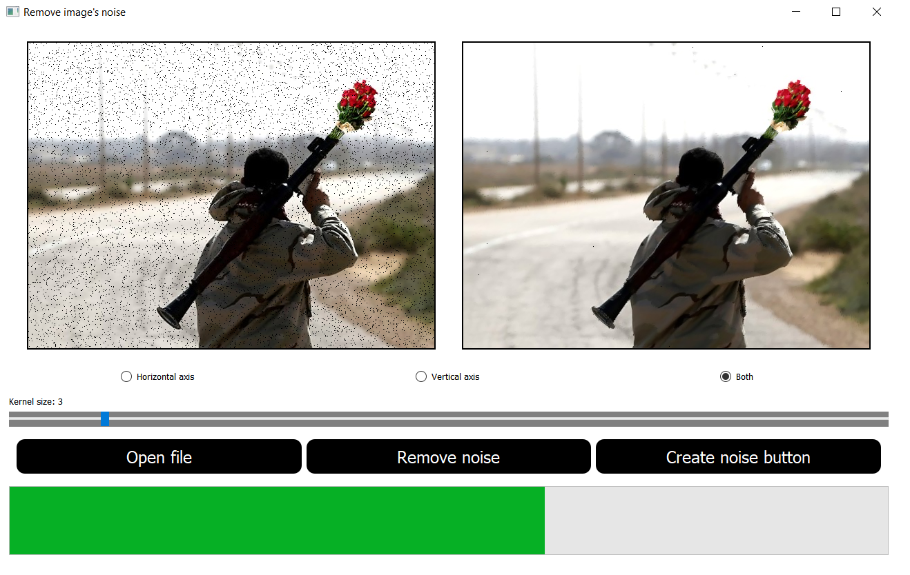

# Лабораторная работа № 1

## Фильтрация изображения от импульсных помех

## Вариант 2

## Реализация

Оригинальное фото:

Зашумленное фото:

Очищенное фото:

Горизонтальная ось - (окно размером Nx1 пикселей, где N - значение ползунка ядра фильтра)
Вертикальная ось - (окно размером 1xN пикселей, где N - значение ползунка ядра фильтра)
Обе оси - (окно размером NхN пикселей, где N - значение ползунка ядра фильтра)
Изображение интерфейса:

##
