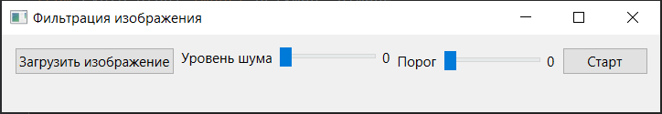
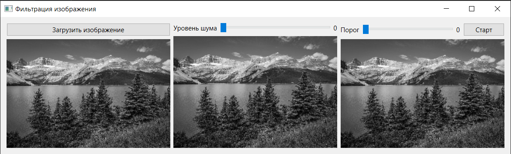
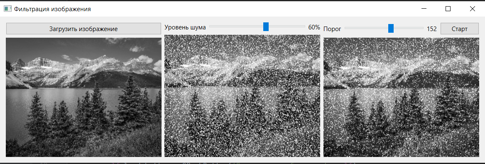

# Лабораторная работа № 1 Селезнёв Н.В.

## Фильтрация изображения от импульсных помех

## Вариант 2

## Описание проекта:

Интерфейс:

Добавим фото:

Отфильтруем изображение от импульсивных помех:

##
