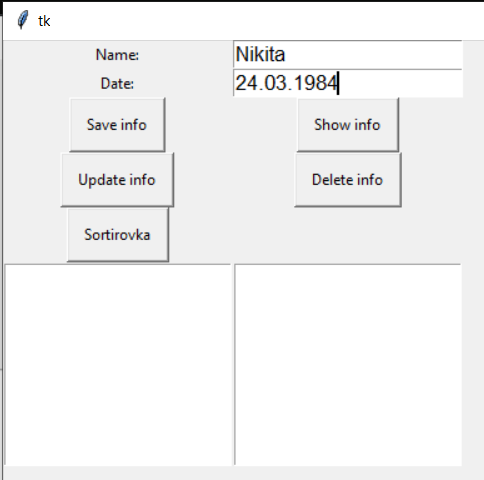
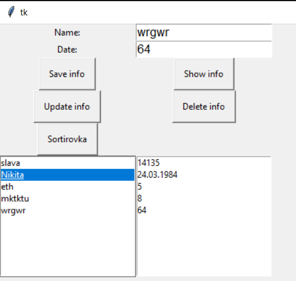
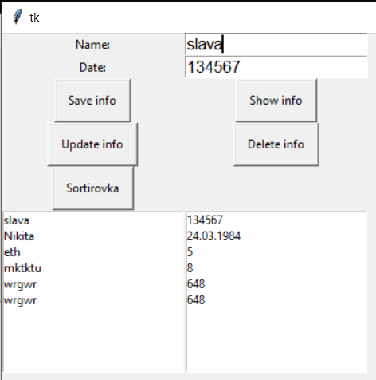
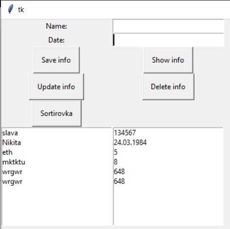
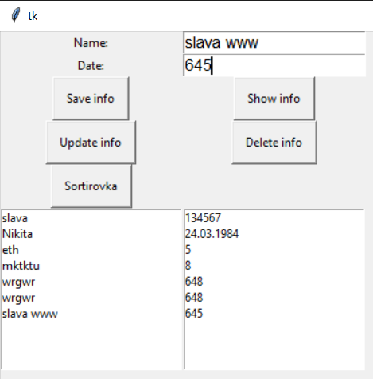
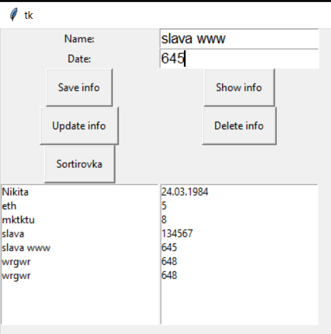

# Лабораторная работа № 2

## CRUD приложение

## основные моменты:

Как создаётся запись:

Как редактируется:

Чтобы выбрать запись, нужно два раза по ней нажать:

Чтобы сохранить запись следует нажать на кнопку:

Отрисовка информации:

Сортировка инфомрации:

До выполнения

После выполнения:

Как удаляется запись:

##
