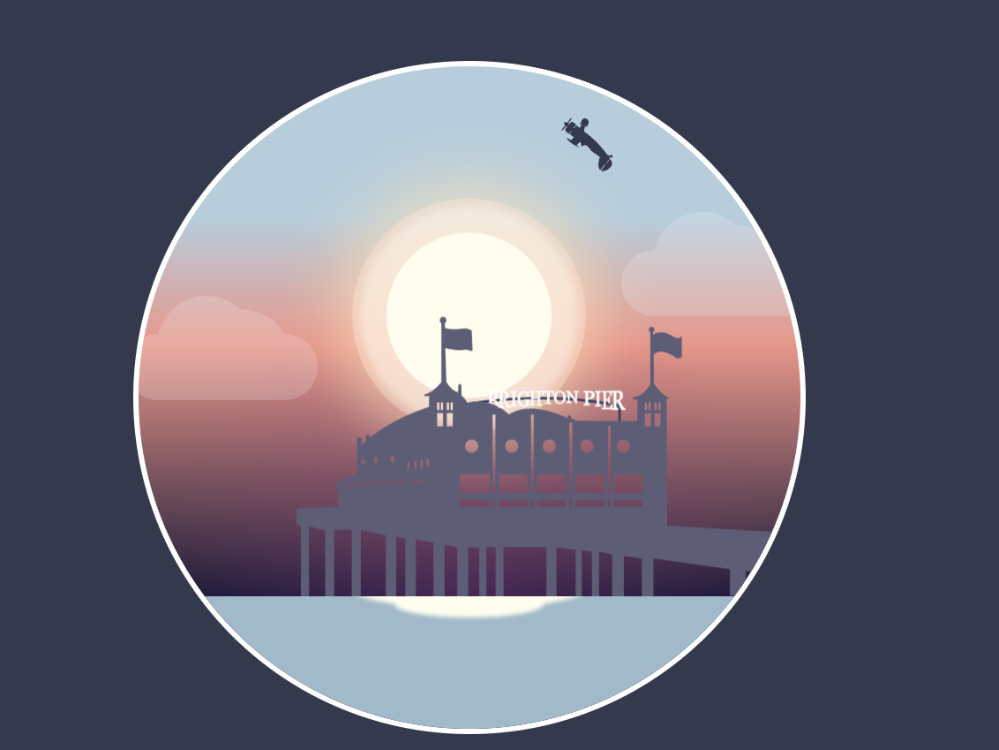
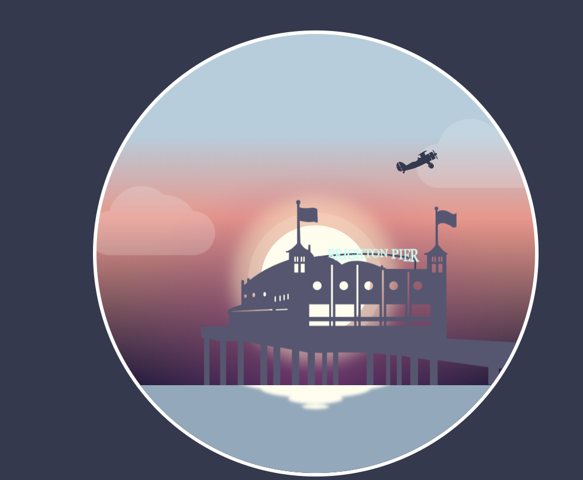
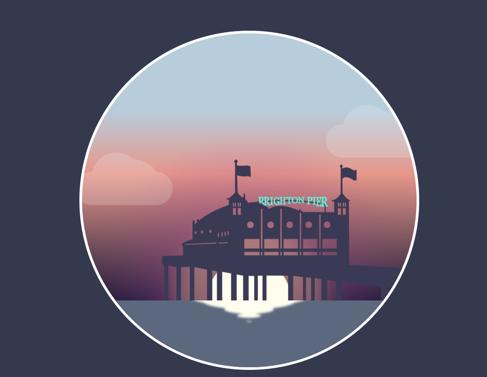

# Лабораторная работа № 6

## Тема: Изображения и анимация

### Средства реализации

Анимация представляет из себя картинку дома на пирсе, над которым летает самолёт, а так же меняется время суток

Сделано на HTML и CSS 

Положение самолёта 1:

   

Положение самолёта 2:

   

Смена времени суток:

   

##
