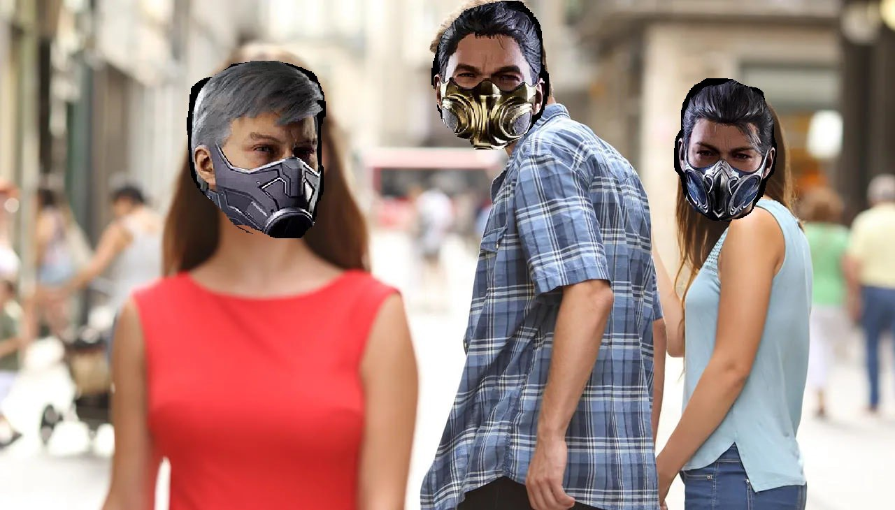
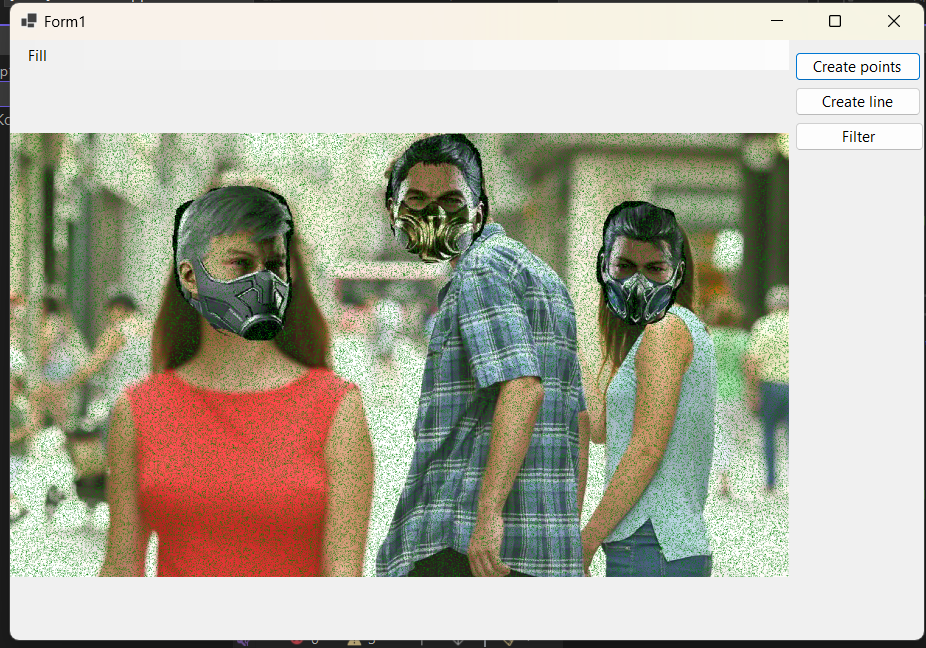
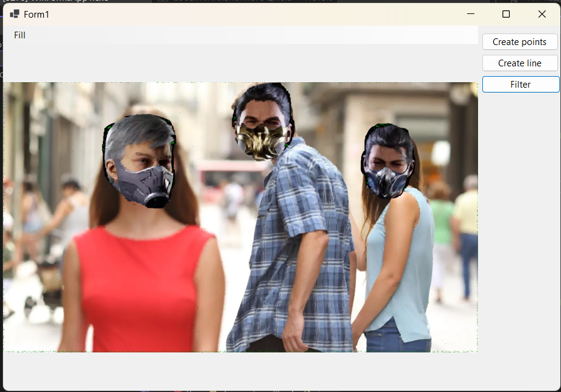

# Лабораторная работа №1

## Тема: Фильтрация изображения от импульсных помех

## Вариант 2

## Реализация

1.  Оригинальное фото:
       
    

2.  Зашумленное фото:
       
    

3.  Обработанное фото:
       
    
